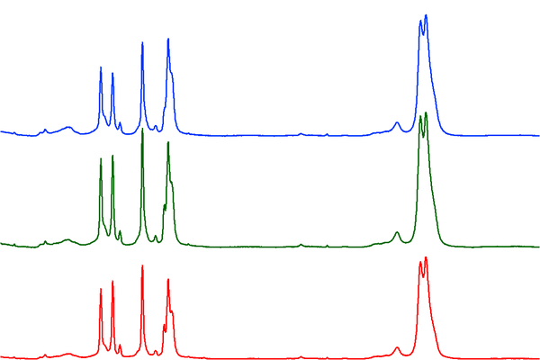
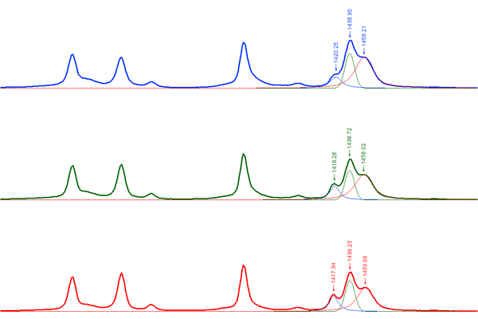

# Spectroscopy Advanced

## How to Interpret the Reported Matches

There are several important things to consider when interpreting a
spectral match including the library source, the Pearson’s r, and other
metrics.

## The Library Source

When you click on a spectrum, all of the metadata that we have in Open
Specy about that source will be displayed in a metadata window below to
the matches table. Each library has different methodologies used to
develop it. It is useful to read up on the library sources from the
literature that they came from. E.g. Chabuka et al. 2020 focuses on
weathered plastics, so matching to it may suggest that your spectrum is
of a weathered polymer. Primpke et al. 2018 only has a spectral range up
to 2000, so some polymers may be difficult to differentiate with it.
Make sure to cite the libraries that you use during your search when you
publish your results. The authors were kind enough to make their data
open access so that it could be used in Open Specy and we should return
the favor by citing them.

## Pearson’s **r**

Correlation values are used to identify the closest matches available in
the current Open Specy spectral libraries to improve material
identification and reduce sample processing times. Pearson’s r values
range from 0 - 1 with 0 being a completely different spectrum and 1
being an exact match. Some general guidelines that we have observed from
using Open Specy. If no matches are \> ~0.6 the material may require
additional processing or may not exist in the Open Specy library.
Correlation values are not the only metric you should use to assess your
spectra’s match to a material in the library, matches need to make
sense.

## Things to Consider beyond Correlation

Peak position and height similarities are more important than
correlation and need to be assessed manually. Peak position correlates
with specific bond types. Peak height correlates to the concentration of
a compound. Therefore, peak height and peak position should match as
closely as possible to the matched spectrum. When there are peaks that
exist in the spectra you are trying to interpret that do not exist in
the match, there may be additional materials to identify. In this case,
restrict the processing range to just the unidentified peak and try to
identify it as an additional component (see also
<https://www.compoundchem.com/2015/02/05/irspectroscopy/>).

Also, check the match metadata to see if the match makes sense. Example:
A single fiber cannot be a “cotton blend” since there would be no other
fibers to make up the rest of the blend. Example: Cellophane does not
degrade into fibers, so a match for a fiber to cellophane wouldn’t make
sense. Example: You are analyzing a particle at room temperature, but
the matched material is liquid at room temperature. The material may be
a component of the particle but it cannot be the whole particle.

## How Specific Do You Need to be in the Material Type of the Match?

You can choose to be specific about how you classify a substance (e.g.
polyester, cellophane) or more general (e.g. synthetic, semi-synthetic,
natural, etc.). The choice depends on your research question. Using more
general groups can speed up analysis time but will decrease the
information you have for interpretation. To identify materials more
generally, you can often clump the identities provided by Open Specy to
suit your needs. For example, matches to “polyester” and “polypropylene”
could be clumped to the category “plastic”.

## How to Differentiate Between Similar Spectra?

One common challenge is differentiating between LDPE and HDPE. But, even
with a low resolution instrument (MacroRAM, 2 cm⁻¹ pixel⁻¹), you can
still see some differences. From a wide view, these low, medium, and
high density PE samples all look relatively similar (figures courtesy of
Bridget O'Donnell, Horiba Scientific):

But, a closer look at the 1450 cm⁻¹ band reveals clear differences:

When you overlay them, you start to see differences in other spectral
regions too:

So, the question is, how do we deal with samples that are very similar
with only subtle differences? Usually, researchers will use MVA
techniques after they’ve collected multiple reference spectra of known
samples (LDPE and HDPE in this case). They can then develop models and
apply them to distinguish between different types of PE. With a
reference database like Open Specy, this is complicated by the fact that
researchers are measuring samples on different instruments with
correspondingly different spectral responses and spectral resolutions.
That makes it even more difficult to accurately match definitively to
LDPE and HDPE as opposed to generic ‘PE’.

One possibility is to place more emphasis (from a computational
perspective) on the bands that show the most difference (the triplet at
1450 cm⁻¹) by restricting the range used to match in Open Specy.

The other, much simpler option is to just match any PE hit to generic
‘PE’ and not specifically HDPE or LDPE.

Another challenge is in differentiating between types of nylons. But,
Raman has a pretty easy time distinguishing nylons. These spectra were
recorded of a series of nylons and the differences are much more
distinguishable compared to the PE results above (nylon 6, 6-6, 6-9,
6-10, and 6-12 top to bottom):

The differences are even more pronounced when you overlay the spectra:

## What to Do When Matches Aren’t Making Sense

1.  Double check that the baseline correction and smoothing parameters
    result in the best processing of the data.
2.  Try reprocessing your spectrum, but limit it to specific peak
    regions with a higher signal to noise ratio.
3.  Restrict the spectral range to include or exclude questionable peaks
    or peaks that were not present in the previous matches.
4.  Restrict the spectral range to exclude things like CO₂ (2200 cm⁻¹)
    or H₂O (~1600 cm⁻¹) in spikes in the IR spectrum.
5.  If nothing above works to determine a quality match, you may need to
    measure the spectrum of your material again or use another spectral
    analysis tool.

## References

Chabuka BK, Kalivas JH (2020). “Application of a Hybrid Fusion
Classification Process for Identification of Microplastics Based on
Fourier Transform Infrared Spectroscopy.” *Applied Spectroscopy*,
**74**(9), 1167–1183. doi:
[10.1177/0003702820923993](https://doi.org/10.1177/0003702820923993).

Cowger W, Gray A, Christiansen SH, De Frond H, Deshpande AD,
Hemabessiere L, Lee E, Mill L, et al. (2020). “Critical Review of
Processing and Classification Techniques for Images and Spectra in
Microplastic Research.” *Applied Spectroscopy*, **74**(9), 989–1010.
doi:
[10.1177/0003702820929064](https://doi.org/10.1177/0003702820929064).

Cowger W, Steinmetz Z, Gray A, Munno K, Lynch J, Hapich H, Primpke S, De
Frond H, Rochman C, Herodotou O (2021). “Microplastic Spectral
Classification Needs an Open Source Community: Open Specy to the
Rescue!” *Analytical Chemistry*, **93**(21), 7543–7548. doi:
[10.1021/acs.analchem.1c00123](https://doi.org/10.1021/acs.analchem.1c00123).

Primpke S, Wirth M, Lorenz C, Gerdts G (2018). “Reference Database
Design for the Automated Analysis of Microplastic Samples Based on
Fourier Transform Infrared (FTIR) Spectroscopy.” *Analytical and
Bioanalytical Chemistry*, **410**(21), 5131–5141. doi:
[10.1007/s00216-018-1156-x](https://doi.org/10.1007/s00216-018-1156-x).

Renner G, Schmidt TC, Schram J (2017). “A New Chemometric Approach for
Automatic Identification of Microplastics from Environmental
Compartments Based on FT-IR Spectroscopy.” *Analytical Chemistry*,
**89**(22), 12045–12053. doi:
[10.1021/acs.analchem.7b02472](https://doi.org/10.1021/acs.analchem.7b02472).

Savitzky A, Golay MJ (1964). “Smoothing and Differentiation of Data by
Simplified Least Squares Procedures.” *Analytical Chemistry*, **36**(8),
1627–1639.

Zhao J, Lui H, McLean DI, Zeng H (2007). “Automated Autofluorescence
Background Subtraction Algorithm for Biomedical Raman Spectroscopy.”
*Applied Spectroscopy*, **61**(11), 1225–1232. doi:
[10.1366/000370207782597003](https://doi.org/10.1366/000370207782597003).
