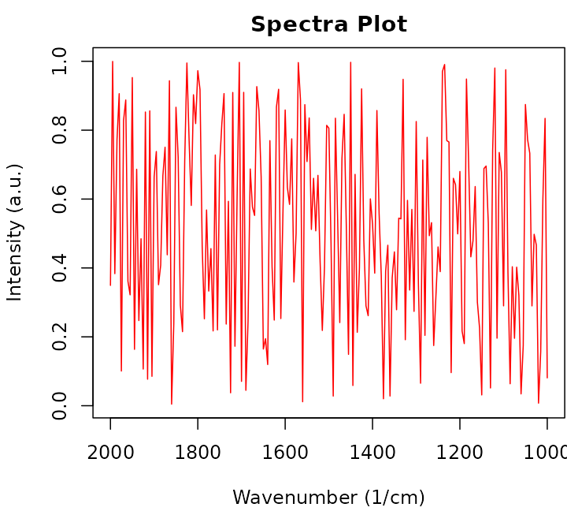
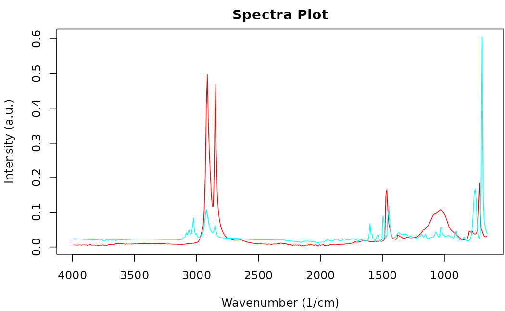

# Open Specy Package Tutorial

## Document Overview

This document outlines a common workflow for using the Open Specy
package and highlights some topics that users are often requesting a
tutorial on. If the document is followed sequentially from beginning to
end, the user will have a better understanding of every procedure
involved in using the Open Specy R package as a tool for interpreting
spectra. It takes approximately 45 minutes to read through and follow
along with this standard operating procedure the first time. Afterward,
knowledgeable users should be able to thoroughly analyze spectra at an
average speed of 1 min⁻¹ or faster with the new batch and automated
procedures.

The Open Specy R package is the backbone of the Shiny app. The choice is
yours as to which you start with, we use both on a regular basis. The
tutorial will talk through the R functions you can use to
programatically analyze spectra. If you are looking for a tutorial about
how to use the app see [this
tutorial](https://raw.githack.com/wincowgerDEV/OpenSpecy-package/main/docs/articles/app.html).

## Installation

After installing the R package, you just need to read in the library.

``` r
library(OpenSpecy)
```

## Running the App

To get started with the Open Specy user interface, access
<https://www.openanalysis.org/openspecy/> or start the Shiny GUI
directly from your own computer in R. If you are looking for a tutorial
about how to use the app see [this
tutorial](https://raw.githack.com/wincowgerDEV/OpenSpecy-package/main/docs/articles/app.html).

``` r
run_app()
```

## Read Data

The following line of code will read in your data when using the package
and interprets which reading function to use based on the file
extension.

``` r
spectra <- read_any("path/to/your/data")
```

Open Specy allows for upload of native Open Specy .csv, .y(a)ml, .json,
or .rds files. Open Specy and .csv files should always load correctly
but the other file types are still in development, though most of the
time these files work perfectly. In addition, .csv, .asp, .jdx, .0,
.spa, .spc, and .zip files can be imported. .zip files can either
contain multiple files with individual spectra in them of the non-zip
formats or it can contain a .hdr and .dat file that form an ENVI file
for a spectral map. If uploading a .csv file, it is ideal to label the
column with the wavenumbers `wavenumber` and name the column with the
intensities `intensity`. Columns besides wavenumber will be interpreted
as unique spectra. If any columns are numbers, the csv will be
interpreted in wide format with the number columns the wavenumbers and
rows containing the unique spectral intensities and metadata contained
in non number columns. Wavenumber units should be cm⁻¹ or use
[`adj_wave()`](https://raw.githack.com/wincowgerDEV/OpenSpecy-package/main/docs/index.html/reference/adj_wave.md)
to correct from wavelength. Always keep a copy of the original file
before alteration to preserve metadata and raw data for your records.

It is best practice to cross check files in the proprietary software
they came from and Open Specy before use in Open Specy. Due to the
complexity of some proprietary file types, we haven’t been able to make
them fully compatible yet. If your file is not working, please contact
the administrator and share the file so that we can work on integrating
it.

The specific steps to converting your instrument’s native files to .csv
can be found in its software manual or you can check out
[Spectragryph](https://www.effemm2.de/spectragryph/), which supports
many spectral file conversions. For instructions, see [Spectragryph
Tutorial](https://raw.githack.com/wincowgerDEV/OpenSpecy-package/main/docs/articles/spectragryph.html).
Unfortunately the maintainer of Spectragryph passed away and it is
unclear how much longer this will be supported.

If you don’t have your own data, you can use a test dataset.

``` r
data("raman_hdpe")
```

We also have many onboard files that you can call to test different
formats:

``` r
spectral_map <- read_extdata("CA_tiny_map.zip") |> 
  read_any() # preserves some metadata
asp_example <- read_extdata("ftir_ldpe_soil.asp") |> 
  read_any() 
ps_example <- read_extdata("ftir_ps.0") |> 
  read_any() # preserves some metadata
csv_example <- read_extdata("raman_hdpe.csv") |> 
  read_any()
json_example <- read_extdata("raman_hdpe.json") |> 
  read_any() # read in exactly as an OpenSpecy object
```

You will notice now that the R package reads in files into an object
with class `OpenSpecy`. This is a class we created for high throughput
spectral analysis which now also preserves spectral metadata. You can
even create these from scratch if you’d like.

``` r
scratch_OpenSpecy <- as_OpenSpecy(x = seq(1000,2000, by = 5), 
                                  spectra =  data.frame(runif(n = 201)), 
                                  metadata = list(file_name = "fake_noise")) 
```

Open Specy objects are lists with three components, `wavenumber` is a
vector of the wavenumber values for the spectra and corresponds to the
rows in `spectra` which is a `data.table` where each column is a set of
spectral intensities. `metadata` is a data.table which holds additional
information about the spectra. Each row in `metadata` corresponds to a
column in `spectra`.

``` r
# Access the wavenumbers
scratch_OpenSpecy$wavenumber
#>   [1] 1000 1005 1010 1015 1020 1025 1030 1035 1040 1045 1050 1055 1060 1065 1070
#>  [16] 1075 1080 1085 1090 1095 1100 1105 1110 1115 1120 1125 1130 1135 1140 1145
#>  [31] 1150 1155 1160 1165 1170 1175 1180 1185 1190 1195 1200 1205 1210 1215 1220
#>  [46] 1225 1230 1235 1240 1245 1250 1255 1260 1265 1270 1275 1280 1285 1290 1295
#>  [61] 1300 1305 1310 1315 1320 1325 1330 1335 1340 1345 1350 1355 1360 1365 1370
#>  [76] 1375 1380 1385 1390 1395 1400 1405 1410 1415 1420 1425 1430 1435 1440 1445
#>  [91] 1450 1455 1460 1465 1470 1475 1480 1485 1490 1495 1500 1505 1510 1515 1520
#> [106] 1525 1530 1535 1540 1545 1550 1555 1560 1565 1570 1575 1580 1585 1590 1595
#> [121] 1600 1605 1610 1615 1620 1625 1630 1635 1640 1645 1650 1655 1660 1665 1670
#> [136] 1675 1680 1685 1690 1695 1700 1705 1710 1715 1720 1725 1730 1735 1740 1745
#> [151] 1750 1755 1760 1765 1770 1775 1780 1785 1790 1795 1800 1805 1810 1815 1820
#> [166] 1825 1830 1835 1840 1845 1850 1855 1860 1865 1870 1875 1880 1885 1890 1895
#> [181] 1900 1905 1910 1915 1920 1925 1930 1935 1940 1945 1950 1955 1960 1965 1970
#> [196] 1975 1980 1985 1990 1995 2000
```

``` r
# Access the spectra
scratch_OpenSpecy$spectra
#>      runif.n...201.
#>               <num>
#>   1:    0.080750138
#>   2:    0.834333037
#>   3:    0.600760886
#>   4:    0.157208442
#>   5:    0.007399441
#>  ---               
#> 197:    0.906051578
#> 198:    0.772730364
#> 199:    0.383370670
#> 200:    0.999652457
#> 201:    0.349299049
```

``` r
# Access the metadata
scratch_OpenSpecy$metadata
#>        x     y  file_name         col_id                          file_id
#>    <int> <int>     <char>         <char>                           <char>
#> 1:     1     1 fake_noise runif.n...201. 74944ff090b28e2fe0504f0e85d29ded
```

``` r
# Performs checks to ensure that OpenSpecy objects are adhering to our standards;
# returns TRUE if it passes. 
check_OpenSpecy(scratch_OpenSpecy)
#> [1] TRUE

# Checks only the object type to make sure it has OpenSpecy type
is_OpenSpecy(scratch_OpenSpecy)
#> [1] TRUE
```

We have some generic functions built for inspecting the spectra:

``` r
print(scratch_OpenSpecy) # shows the raw object
#>      wavenumber runif.n...201.
#>           <num>          <num>
#>   1:       1000    0.080750138
#>   2:       1005    0.834333037
#>   3:       1010    0.600760886
#>   4:       1015    0.157208442
#>   5:       1020    0.007399441
#>  ---                          
#> 197:       1980    0.906051578
#> 198:       1985    0.772730364
#> 199:       1990    0.383370670
#> 200:       1995    0.999652457
#> 201:       2000    0.349299049
#> 
#> $metadata
#>        x     y  file_name         col_id                          file_id
#>    <int> <int>     <char>         <char>                           <char>
#> 1:     1     1 fake_noise runif.n...201. 74944ff090b28e2fe0504f0e85d29ded
```

``` r
summary(scratch_OpenSpecy) # summarizes the contents of the spectra
#> $wavenumber
#>  Length Min. Max.     Res.
#>     201 1000 2000 4.975124
#> 
#> $spectra
#>  Number Min. Intensity Max. Intensity
#>       1    0.004496308      0.9996525
#> 
#> $metadata
#>   Min. Max.
#> x    1    1
#> y    1    1
#> [1] "x"         "y"         "file_name" "col_id"    "file_id"
```

``` r
head(scratch_OpenSpecy) # shows the top wavenumbers and intensities
#>    wavenumber runif.n...201.
#>         <num>          <num>
#> 1:       1000    0.080750138
#> 2:       1005    0.834333037
#> 3:       1010    0.600760886
#> 4:       1015    0.157208442
#> 5:       1020    0.007399441
#> 6:       1025    0.466393497
```

## Save Data

Open Specy objects can be saved most accurately as .csv, .rds, .yml, or
.json files. .rds will be the most reproducible as it is a native R file
format and floating point errors can happen with .csv, .json, or .yml.

``` r
write_spec(scratch_OpenSpecy, "test_scratch_OpenSpecy.yml", digits = 5)
write_spec(scratch_OpenSpecy, "test_scratch_OpenSpecy.json", digits = 5)
write_spec(scratch_OpenSpecy, "test_scratch_OpenSpecy.csv", digits = 5)
```

## Format Conversions

Another great spectroscopy R package is
[hyperSpec](https://CRAN.R-project.org/package=hyperSpec). We actually
depend on their functions for several of ours. They are currently making
some awesome new features and we want to integrate well with them so
that both packages can be easily used together. That is why we created
the `as_hyperSpec` function and made sure that `as_OpenSpecy` can
convert from `hyperSpec` objects.

``` r
hyperspecy <- as_hyperSpec(scratch_OpenSpecy)
```

## Visualization

### Spectra

In R, we have two ways to visualize your spectra, one is quick and
efficient and the other is interactive. Here is an example of quick and
efficient plotting.

``` r
plot(scratch_OpenSpecy) # quick and efficient
```



This is an example of an interactive plot. You can plot two different
datasets simultaneously to compare.

``` r
# This will min-max normalize your data even if it isn't already but are not
# changing your underlying data
plotly_spec(scratch_OpenSpecy, json_example)
```

### Maps

Spectral maps can also be visualized as overlaid spectra but in addition
the spatial information can be plotted as a heatmap. It is important to
note that when multiple spectra are uploaded in batch they are
prescribed `x` and `y` coordinates, this can be helpful for visualizing
summary statistics and navigating vast amounts of data but shouldn’t be
confused with data which actually has spatial coordinates.

In R the user can control what values form the colors of the heatmap by
specifying `z`, it is handy to put the information you want in the
metadata for this reason. This example just shows the x values of the
spectra.

``` r
heatmap_spec(spectral_map,
             z = spectral_map$metadata$x)
```

An interactive plot of the heatmap and spectra overlayed can be
generated with the
[`interactive_plot()`](https://raw.githack.com/wincowgerDEV/OpenSpecy-package/main/docs/index.html/reference/interactive_plots.md)
function. A user can hover over the heatmap to identify the next row id
they are interested in and update the value of select to see that
spectrum.

``` r
interactive_plot(spectral_map, select = 100, z = spectral_map$metadata$x)
```

  

## Combining OpenSpecy Objects

Sometimes you have several OpenSpecy objects that you want to combine
into one. The easiest way to do that is by having spectra which all are
in the same exact format with the same series of wavenumbers. The
default settings of `c_spec` assume that is the case.

If you have different wavenumber ranges for the spectra you want to
combine, you can set `range = "common"` and `res` equal to the
wavenumber resolution you want and the function will collapse all the
spectra to whatever their common range is using linear interpolation.

``` r
combined <- c_spec(list(asp_example, ps_example), range = "common", res = 8) 

combined |> 
  plot()
```



If you want to plot them with standardized offset y values you can do so
with the plot variables.

``` r
plot(combined |> make_rel(), offset = 3, legend_var = "file_name")
```


## Filtering OpenSpecy Objects

OpenSpecy objects can have any number of spectra in them. To create an
OpenSpecy with a subset of the spectra that is in an Open Specy object
you can use the `filter_spec` function. Filtering is allowed by index
number, name, or using a logical vector. Filtering will update the
`spectra` and `metadata` items of the `OpenSpecy` but not the
`wavenumber`.

``` r
# Extract the 150th spectrum by index number. 
filter_spec(spectral_map, 150)
# Extract the 150th spectrum by spectrum name. 
filter_spec(spectral_map, "9_5")
# Extract the 150th spectrum by logical test. 
filter_spec(spectral_map, spectral_map$metadata$x == 9 &  spectral_map$metadata$y == 5)

#Test that they are the same. 
identical(filter_spec(spectral_map, 150), filter_spec(spectral_map, "9_5"))

identical(filter_spec(spectral_map, 150), filter_spec(spectral_map, spectral_map$metadata$y == 9 & spectral_map$metadata$x == 5))
```

## Sampling OpenSpecy Objects

Sometimes you have a large suite of examples of spectra of the same
material and you want to reduce the number of spectra you run through
the analysis for simplicity or you are running simulations or other
procedures that require you to first sample from the spectra contained
in your OpenSpecy objects before doing analysis. The `sample_spec`
function serves this purpose.

``` r
sample_spec(spectral_map, size = 5) |>
  plot()
```


## Processing

The goal of processing is to increase the signal to noise ratio (S/N) of
the spectra and remove unwanted artifacts without distorting the shape,
position, or relative size of the peaks. After loading data, you can
process the data using intensity adjustment, baseline subtraction,
smoothing, flattening, and range selection. The default settings is an
absolute first derivative transformation. It is really powerful for many
data issues. It does something similar to smoothing, baseline
subtraction, and intensity correction simultaneously and really quickly.

The
[`process_spec()`](https://raw.githack.com/wincowgerDEV/OpenSpecy-package/main/docs/index.html/reference/process_spec.md)
function is a monolithic function for all processing procedures which is
optimized by default to result in high signal to noise in most cases,
same as the app.

``` r
processed <- process_spec(raman_hdpe)
```

You can compare the processed and unprocessed data in an overlay plot.

``` r
plotly_spec(raman_hdpe, processed)
```

We want people to use the
[`process_spec()`](https://raw.githack.com/wincowgerDEV/OpenSpecy-package/main/docs/index.html/reference/process_spec.md)
function for most processing operations. All other processing functions
can be tuned using its parameters in the single function see
`?process_spec()` for details. However, we recognize that nesting of
functions and order of operations can be useful for users to control so
you can also use individual functions for each operation if you’d like.
See explanations of each processing sub-function below.

### Threshold Signal and Noise

Considering whether you have enough signal to analyze spectra in the
first place is important, because if you don’t have enough signal you
should recollect the spectrum. Classical spectroscopy would recommend
your highest peak to be at least 10 times greater than the baseline of
your processed spectra before you begin analysis. Setting a threshold
can assist in standardized differentiation between low and high quality
spectral. If your spectra is below that threshold even after processing,
you may want to consider recollecting it. In practice, we are rarely
able to collect spectra of that good quality and more often use 4 as a
lower bound with anything below 2 being completely unusable. The
“run_sig_over_noise” `metric` searches your spectra for high and low
regions and conducts division on them to derive the signal to noise
ratio. In the example below you can see that our signal to noise ratio
is increased by the processing, the goal of processing is generally to
maximize the signal to noise ratio. If you know where your signal region
and noise regions are, you can specify them with `sig_min`, `sig_max`,
`noise_min`, and `noise_max`.

``` r
# Automatic signal to noise ratio comparison
sig_noise(processed, metric = "run_sig_over_noise") > 
  sig_noise(raman_hdpe, metric = "run_sig_over_noise")

#Manual signal to noise ratio calculation
sig_noise(processed, metric = "sig_over_noise", sig_min = 2700, sig_max = 3000, noise_min = 1500, noise_max = 2500) > 
  sig_noise(raman_hdpe, metric = "sig_over_noise", sig_min = 2700, sig_max = 3000, noise_min = 1500, noise_max = 2500)
```

If analyzing spectra in batch, we recommend looking at the heatmap and
optimizing the percent of spectra that are above your signal to noise
threshold to determine the correct settings instead of looking through
spectra individually. Setting the `min_sn` will threshold the heatmap
image to only color spectra which have a `sn` value over the threshold.

``` r
#Remove CO2 region
spectral_map_p <- spectral_map |>
  process_spec(flatten_range = T)

#Calculate signal times noise
spectral_map_p$metadata$sig_noise <- sig_noise(spectral_map_p, metric = "run_sig_over_noise")

#Plot result
heatmap_spec(spectral_map_p, sn = spectral_map_p$metadata$sig_noise, min_sn = 5)
```

### Intensity Adjustment

Most functions in Open Specy assume that intensity units are in
absorbance units and Open Specy can adjust reflectance or transmittance
spectra to absorbance units. The transmittance adjustment uses the
$\log_{10}1/T$ calculation which does not correct for system or particle
characteristics. The reflectance adjustment uses the Kubelka-Munk
equation $\frac{(1 - R)^{2}}{2R}$.

This is the respective R code for a scenario where the spectra doesn’t
need intensity adjustment:

``` r
trans_raman_hdpe <- raman_hdpe
trans_raman_hdpe$spectra <- 2 - trans_raman_hdpe$spectra^2
    
rev_trans_raman_hdpe <- trans_raman_hdpe |> 
  adj_intens(type = "transmittance")

plotly_spec(trans_raman_hdpe, rev_trans_raman_hdpe)
```

### Conforming

Conforming spectra is essential before comparing to a reference library
and can be useful for summarizing data when you don’t need it to be
highly resolved spectrally. We set the default spectral resolution to 5
because this tends to be pretty good for a lot of applications and is in
between 4 and 8 which are commonly used wavenumber resolutions.

``` r
conform_spec(raman_hdpe, res = 8) |> # Convert res to 8 wavenumbers.
  summary()

# Force one spectrum to have the exact same wavenumbers as another
conform_spec(asp_example, range = ps_example$wavenumber, res = NULL) |> 
  summary()
```

### Smoothing

The [Savitzky-Golay
filter](https://en.wikipedia.org/wiki/Savitzky%E2%80%93Golay_filter) is
used for smoothing. Higher polynomial numbers lead to more wiggly fits
and thus less smoothing, lower numbers lead to more smooth fits. The SG
filter is fit to a moving window of 11 data points by default where the
center point in the window is replaced with the polynomial estimate.
Larger windows will produce smoother fits. The derivative order is set
to 1 by default which transforms the spectra to their first derivative.
A zero order derivative will have no derivative transformation and only
apply smoothing. When smoothing is done well, peak shapes and relative
heights should not change. The absolute value is primarily useful for
first derivative spectra where the result looks similar to absorbance
units and is easy to have intuition about.

Examples of smoothing:

``` r
none <- make_rel(raman_hdpe)
p1 <- smooth_intens(raman_hdpe, polynomial = 1, derivative = 0, abs = F)
p4 <- smooth_intens(raman_hdpe, polynomial = 4, derivative = 0, abs = F)

c_spec(list(none, p1, p4)) |> 
  plot()
```


Sample `raman_hdpe` spectrum with different smoothing polynomials.

Derivative transformation can be done with the same function.

``` r
none <- make_rel(raman_hdpe)
window <- calc_window_points(raman_hdpe, 100) #Calculate the number of points needed for a 190 wavenumber window.
d1 <- smooth_intens(raman_hdpe, derivative = 1, window = window, abs = T)
d2 <- smooth_intens(raman_hdpe, derivative = 2, window = window, abs = T)

c_spec(list(none, d1, d2)) |> 
  plot()
```


Sample `raman_hdpe` spectrum with different derivatives.

### Baseline Correction

The goal of baseline correction is to get all non-peak regions of the
spectra to zero absorbance. The higher the polynomial order, the more
wiggly the fit to the baseline. If the baseline is not very wiggly, a
more wiggly fit could remove peaks which is not desired. The baseline
correction algorithm used in Open Specy is called “iModPolyfit” (Zhao et
al. 2007). This algorithm iteratively fits polynomial equations of the
specified order to the whole spectrum. During the first fit iteration,
peak regions will often be above the baseline fit. The data in the peak
region is removed from the fit to make sure that the baseline is less
likely to fit to the peaks. The iterative fitting terminates once the
difference between the new and previous fit is small. An example of a
good baseline fit below. Manual baseline correction can also be
specified by providing a baseline `OpenSpecy` object. There are many
fine tuning options that can be chosen, see `?subtr_baseline()` for more
details.

``` r
alternative_baseline <- smooth_intens(raman_hdpe, polynomial = 1, window = 51,
                                      derivative = 0, abs = F, make_rel = F) |>
  flatten_range(min = 2700, max = 3200, make_rel = F) #Manual baseline with heavily smoothed spectra

none <- make_rel(raman_hdpe) #raw
d <- subtr_baseline(raman_hdpe, type = "manual",
                     baseline = alternative_baseline) #manual subtraction
d8 <- subtr_baseline(raman_hdpe, degree = 8) #standard imodpolyfit
dr <- subtr_baseline(raman_hdpe, refit_at_end = T) #optionally retain baseline noise with refitting

c_spec(list(none, d, d8, dr)) |> 
  plot(offset = 0.25)
```


Sample `raman_hdpe` spectrum with different degrees of background
subtraction (Cowger et al., 2020).

### Range Selection

Sometimes an instrument operates with high noise at the ends of the
spectrum and, a baseline fit produces distortions, or there are regions
of interest for analysis. Range selection accomplishes those goals. Many
of these issues can be resolved during spectral collection by specifying
a wavenumber range which is well characterized by the instrument.
Multiple ranges can be specified simultaneously.

``` r
none <- make_rel(raman_hdpe)

#Specify one range
r1 <- restrict_range(raman_hdpe, min = 1000, max = 2000) |>
    conform_spec(range = none$wavenumber, res = NULL, allow_na = T)

#Specify multiple ranges
r2 <- restrict_range(raman_hdpe, min = c(1000, 1800), max = c(1200, 2000)) |>
        conform_spec(range = none$wavenumber, res = NULL, allow_na = T)

compare_ranges <- c_spec(list(none, r1, r2), range = "common")
# Common argument crops the ranges to the most common range between the spectra
# when joining. 

plot(compare_ranges)
```


Sample `raman_hdpe` spectrum with different degrees of range
restriction.

### Flattening Ranges

Sometimes there are peaks that really shouldn’t be in your spectra and
can distort your interpretation of the spectra but you don’t necessarily
want to remove the regions from the analysis because you believe those
regions should exist and be flat instead of having a peak. One way to
deal with this is to replace the peak values with the mean of the values
around the peak. This is the purpose of the `flatten_range` function. By
default it is set to flatten the CO2 region for FTIR spectra because
that region often needs to be flattened when atmospheric artifacts occur
in spectra. Like `restrict_range`, the R function can accept multiple
ranges.

``` r
single <- filter_spec(spectral_map, 120) # Function to filter spectra by index
                                         # number or name or a logical vector. 
none <- make_rel(single)
f1 <- flatten_range(single) #default flattening the CO2 region. 
f2 <- flatten_range(single, min = c(1000, 2500), max = c(1200, 3000)) #multple range example

compare_flats <- c_spec(list(none, f1, f2), range = "common")

plot(compare_flats, offset = 0.25)
```


Sample `raman_hdpe` spectrum with different degrees of background
subtraction (Cowger et al., 2020).

### Min-Max Normalization

Often we regard spectral intensities as arbitrary and min-max
normalization allows us to view spectra on the same scale without
drastically distorting their shapes or relative peak intensities. In the
package, most of the processing functions will min-max transform your
spectra by default if you do not specify otherwise with
`make_rel = FALSE`.

``` r

raman_hdpe |> plot()

make_rel(raman_hdpe) |> plot()
```

## Identifying Spectra

### Reading Libraries

Reference libraries are spectra with known identities. The Open Specy
library now has over 30,000 spectra in it and is getting so large that
we cannot fit it within the R package size limit of 5 MB. We host the
reference libraries on [OSF](https://osf.io/x7dpz/) and have a function
to pull the libraries down automatically. Running get_lib by itself will
download all libraries to your package directory or you can specify
which libraries you want and where you want them.

``` r
get_lib(type = "derivative")
```

After download you can load the libraries into your active environment
one at a time as `OpenSpecy` objects. You can use any Open Specy object
as a library which makes it easy to work with and create libraries
because everything we explained earlier applies to them.

``` r
lib <- load_lib(type = "derivative")
```

### Matches

Before attempting to use a reference library to identify spectra it is
really important to understand what format the reference library is in.
All the OpenSpecy reference libraries are in Absorbance units.
`derivative` has been absolute first derivative transformed,
`nobaseline` has been baseline corrected, `raw` is the rawest form of
the reference spectra (not recommended except for advanced uses). The
previously mentioned libraries all have Raman and FTIR spectra in them.
`mediod_{derivative or nobasline}` is the mediod compressed library
version of the libraries and has only critical spectra in it,
`model{derivative or nobasline}` is an exception because it is a
multinomial regression approach for identification. In this example we
use the `data("test_lib")` which is a subsampled version of the
`derivative` library and `data("raman_hdpe")` which is an unprocessed
Raman spectrum in absorbance units of HDPE plastic.

``` r
data("test_lib")
data("raman_hdpe")

processed <- process_spec(x = raman_hdpe, 
                          conform_spec = F, #We will conform during matching. 
                          smooth_intens = T #Conducts the default derivative transformation. 
                          )

# Check to make sure that the signal to noise ratio of the processed spectra is
# greater than 10.
print(sig_noise(processed) > 10)

#Plot to assess the accuracy of the processing visually
plotly_spec(raman_hdpe, processed)
```

After your spectra is processed similarly to the library specifications,
you can identify the spectra using
[`match_spec()`](https://raw.githack.com/wincowgerDEV/OpenSpecy-package/main/docs/index.html/reference/match_spec.md).
Whichever library you choose, you need to get your spectra into a
similar enough format to use for comparison. The `add_library_metadata`
and `add_object_metadata` options specify the column name in the
metadata that you want to add metadata from and `top_n` specifies how
many matches you want. In this example we just identified a single
spectrum with the library but you can also send an OpenSpecy object with
multiple spectra. The output `matches` is a data.table with at least 3
columns, `object_id` tells you the column names of the spectra in `x`,
`library_id` tells you the column names from the library that it matched
to. `match_val` is the value of the Pearson correlation coefficient
(default) or other correlation if specified in `...` or if using the
model identification option `match_val` will be the model confidence.
The output in this example returned the correct material type, HDPE, as
the top match. If using Pearson correlation, 0.7 is a good threshold to
use for a positive ID. In this example, only our top match is greater
than the threshold so we would disregard the other matches. If no
matches were above our threshold, we would proclaim that the spectrum is
of an unknown identity. You’ll also notice in this example that we
matched to a library with both Raman and FTIR spectra but the Raman
spectra had the highest hits, this is the rationale for lazily matching
to a library with both. If you want to just match to a library with FTIR
or Raman spectra, you can first filter the library using
[`filter_spec()`](https://raw.githack.com/wincowgerDEV/OpenSpecy-package/main/docs/index.html/reference/match_spec.md)
using `SpectrumType`.

``` r
matches <- match_spec(x = processed, library = test_lib, conform = T,
                      add_library_metadata = "sample_name", top_n = 5)[order(match_val, decreasing = T)]
print(matches[,c("object_id", "library_id", "match_val", "SpectrumType",
                 "SpectrumIdentity")])
```

### Library Metadata

The libraries we have created have over 100 variables of metadata in
them and this can be onerous to read through especially given that many
of the variables are `NA` values. We created
[`get_metadata()`](https://raw.githack.com/wincowgerDEV/OpenSpecy-package/main/docs/index.html/reference/match_spec.md)
to remedy this by removing columns from the metadata which are all blank
values. The function below will return the metadata for the top match in
`matches`. Remember, similar
[`filter_spec()`](https://raw.githack.com/wincowgerDEV/OpenSpecy-package/main/docs/index.html/reference/match_spec.md),
you can specify `logic` for more than one thing at a time.

``` r
get_metadata(x = test_lib, logic = matches[[1,"library_id"]], rm_empty = T)
```

### Plot Matches

Overlaying unknown spectra and the best matches can be extremely useful
to identify peaks that don’t fit to the reference library which may need
further investigation. The example below shows great correspondence
between the best match and the unknown spectrum. All major peaks are
accounted for and the correct relative height. There are two small peaks
in the unknown spectrum near 500 that are not accounted for which could
be investigated further but we would call this a positive id to HDPE.

``` r
plotly_spec(processed, filter_spec(test_lib, logic = matches[[1,"library_id"]]))
```

### Sharing Reference Data

If you have reference data or AI models that you think would be useful
for sharing with the spectroscopy community through OpenSpecy please
contact the package administrator to discuss options for collaborating.

## Characterizing Particles

Sometimes the spectroscopy task we want to perform is to identify
particles in a spectral map. This is especially common for microplastic
analysis where a spectral map is used to image a sample and spectral
information is used to differentiate microplastic particles from
nonplastic particles. In addition to the material id, one often wants to
measure the shape and size of the particles. In a brute force technique,
one could first identify every spectrum in the map, then use
thresholding and image analysis to measure the particles. However, more
often than not, particles are well separated on the image surface and
background spectra is quite different from particle spectra and
therefore we can use thresholding a priori to identify and measure the
particles, then pass an exemplary spectrum for each particle to the
identification routine. It is important to note here that this is at the
bleeding edge of theory and technique so we may be updating these
functions in the near future.

### Brute Force

``` r
#Test library
data("test_lib")

#Example hyperspectral image with one cellulose acetate particle in the middle of it. 
test_map <- read_any(read_extdata("CA_tiny_map.zip"))

#Process the map to conform to the library. 
test_map_processed <- process_spec(test_map, conform_spec_args = list(
  range = test_lib$wavenumber, res = NULL)
  )

#Identify every spectrum in the map. 
identities <- match_spec(test_map_processed, test_lib, order = test_map,
                         add_library_metadata = "sample_name", top_n = 1)

#Relabel any spectra with low correlation coefficients. 
features <- ifelse(identities$match_val > 0.7,
                   tolower(identities$polymer_class), "unknown")

#Use spectra identities to identify particle regions as those that have the same material type and are touching. 
id_map <- def_features(x = test_map_processed, features = features)

id_map$metadata$identities <- features
# Also should probably be implemented automatically in the function when a
# character value is provided. 
heatmap_spec(id_map, z = id_map$metadata$identities)

# Collapses spectra to their median for each particle
test_collapsed <- collapse_spec(id_map)

# Plot spectra for each identified particle
plot(test_collapsed, offset = 1, legend_var = "feature_id")
```

### A Priori Particle Thresholding

``` r
# Read in test library
data("test_lib")

# Example dataset with one cellulose acetate particle.Conduct spatial smoothing to average each spectrum using adjacent spectra. 
test_map <- read_any(read_extdata("CA_tiny_map.zip"),   
                     spectral_smooth = T,
                     sigma = c(1, 1, 1))

# Characterize the signal times noise to determine where particle regions are.  
snr <- sig_noise(test_map, metric = "sig_times_noise")

# Use this to find your particles and the idal signal times noise value to use for thresholding. 
heatmap_spec(test_map, z = snr)

# Define the feature regions based on the threshold. Pixels from the background in the heatmap above were below 0.05 while my particle's pixels were above so I set snr > 0.05.  
id_map <- def_features(x = test_map, features = snr > 0.05) 

# Check that the thresholding worked as expected. Here we see a single particle region identified separate from the background. 
heatmap_spec(id_map, z = id_map$metadata$feature_id)

# Collapse the spectra to their medians based on the threshold. Important to
# note here that the particles with id -88 are anything from the FALSE values
# so they should be your background. 
collapsed_id_map <- id_map |>
  collapse_spec()

# Process the collapsed spectra to have the same transformation and units as the library. 
id_map_processed <- process_spec(collapsed_id_map, conform_spec_args = list(
  range = test_lib$wavenumber, res = NULL)
  )

# Check the spectra for the background and particle. Background has considerable signal in it too suggesting double bounce along the edges of the particle. 
plot(id_map_processed, offset = 1, legend_var = "feature_id")

# Get the matches of the collapsed spectra for the particles.
matches <- match_spec(id_map_processed, test_lib,
                      add_library_metadata = "sample_name", top_n = 1)
```

## References

Chabuka BK, Kalivas JH (2020). “Application of a Hybrid Fusion
Classification Process for Identification of Microplastics Based on
Fourier Transform Infrared Spectroscopy.” *Applied Spectroscopy*,
**74**(9), 1167–1183. doi:
[10.1177/0003702820923993](https://doi.org/10.1177/0003702820923993).

Cowger W, Gray A, Christiansen SH, De Frond H, Deshpande AD,
Hemabessiere L, Lee E, Mill L, et al. (2020). “Critical Review of
Processing and Classification Techniques for Images and Spectra in
Microplastic Research.” *Applied Spectroscopy*, **74**(9), 989–1010.
doi:
[10.1177/0003702820929064](https://doi.org/10.1177/0003702820929064).

Cowger W, Steinmetz Z, Gray A, Munno K, Lynch J, Hapich H, Primpke S, De
Frond H, Rochman C, Herodotou O (2021). “Microplastic Spectral
Classification Needs an Open Source Community: Open Specy to the
Rescue!” *Analytical Chemistry*, **93**(21), 7543–7548. doi:
[10.1021/acs.analchem.1c00123](https://doi.org/10.1021/acs.analchem.1c00123).

Primpke S, Wirth M, Lorenz C, Gerdts G (2018). “Reference Database
Design for the Automated Analysis of Microplastic Samples Based on
Fourier Transform Infrared (FTIR) Spectroscopy.” *Analytical and
Bioanalytical Chemistry*, **410**(21), 5131–5141. doi:
[10.1007/s00216-018-1156-x](https://doi.org/10.1007/s00216-018-1156-x).

Renner G, Schmidt TC, Schram J (2017). “A New Chemometric Approach for
Automatic Identification of Microplastics from Environmental
Compartments Based on FT-IR Spectroscopy.” *Analytical Chemistry*,
**89**(22), 12045–12053. doi:
[10.1021/acs.analchem.7b02472](https://doi.org/10.1021/acs.analchem.7b02472).

Savitzky A, Golay MJ (1964). “Smoothing and Differentiation of Data by
Simplified Least Squares Procedures.” *Analytical Chemistry*, **36**(8),
1627–1639.

Zhao J, Lui H, McLean DI, Zeng H (2007). “Automated Autofluorescence
Background Subtraction Algorithm for Biomedical Raman Spectroscopy.”
*Applied Spectroscopy*, **61**(11), 1225–1232. doi:
[10.1366/000370207782597003](https://doi.org/10.1366/000370207782597003).
