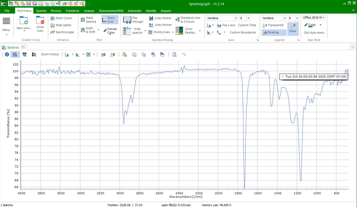
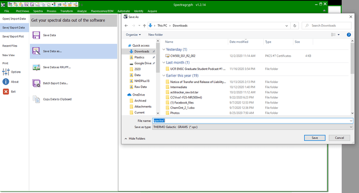

# File Conversion in SpectraGryph

[Spectragryph](https://www.effemm2.de/spectragryph/) supports many
spectral file conversions which facilitate data import to Open Specy.

1.  Download Spectragryph from
    <https://www.effemm2.de/spectragryph/down.html>

2.  Open Spectragryph and upload your file by dragging and dropping it
    into the console.

3.  Click File, Save/export data, save data as, and save it as an spc
    file.

4.  Then upload that .spc file to Open Specy.
