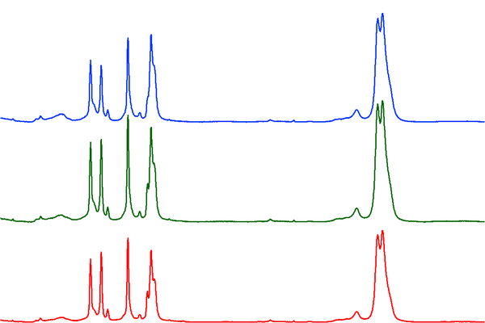
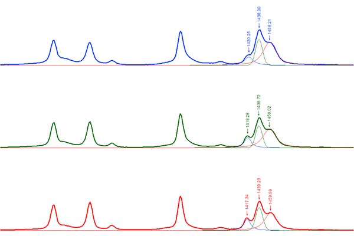
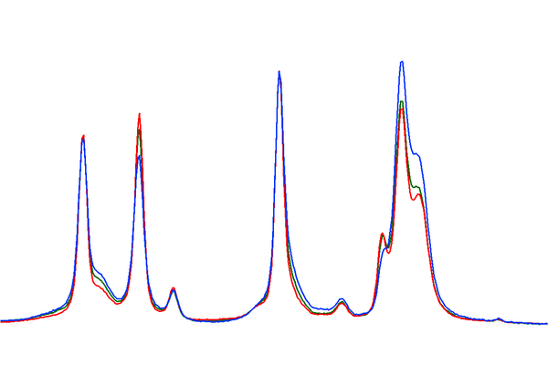
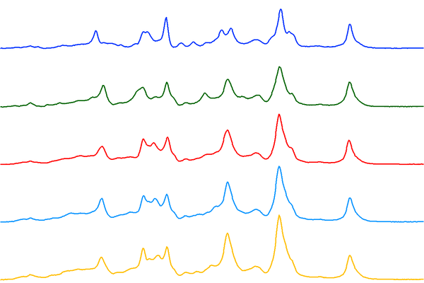
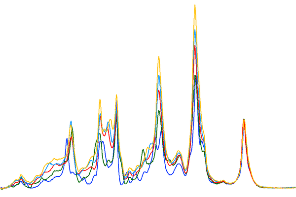

```{r, include = FALSE}
knitr::opts_chunk$set(
  collapse = TRUE,
  comment = "#>",
  warning = FALSE
)
```

# How to Interpret the Reported Matches

There are several important things to consider when interpreting a spectral
match including the library source, the Pearson's r, and other metrics.

# The Library Source

When you click on a spectrum, all of the metadata that we have in Open Specy
about that source will be displayed in a metadata window below to the matches
table. Each library has different methodologies used to develop it. It is useful
to read up on the library sources from the literature that they came from. E.g.
Chabuka et al. 2020 focuses on weathered plastics, so matching to it may suggest
that your spectrum is of a weathered polymer. Primpke et al. 2018 only has a
spectral range up to 2000, so some polymers may be difficult to differentiate
with it. Make sure to cite the libraries that you use during your search when
you publish your results. The authors were kind enough to make their data open
access so that it could be used in Open Specy and we should return the favor by
citing them.

# Pearson's **r**

Correlation values are used to identify the closest matches available in the
current Open Specy spectral libraries to improve material identification and
reduce sample processing times. Pearson's r values range from 0 - 1 with 0 being
a completely different spectrum and 1 being an exact match. Some general
guidelines that we have observed from using Open Specy. If no matches are \>
\~0.6 the material may require additional processing or may not exist in the
Open Specy library. Correlation values are not the only metric you should use to
assess your spectra's match to a material in the library, matches need to make
sense.

# Things to Consider beyond Correlation

Peak position and height similarities are more important than correlation and
need to be assessed manually. Peak position correlates with specific bond types.
Peak height correlates to the concentration of a compound. Therefore, peak
height and peak position should match as closely as possible to the matched
spectrum. When there are peaks that exist in the spectra you are trying to
interpret that do not exist in the match, there may be additional materials to
identify. In this case, restrict the processing range to just the
unidentified peak and try to identify it as an additional component (see also
[https://www.compoundchem.com/2015/02/05/irspectroscopy/](https://www.compoundchem.com/2015/02/05/irspectroscopy/)).

Also, check the match metadata to see if the match makes sense. Example: A
single fiber cannot be a "cotton blend" since there would be no other fibers to
make up the rest of the blend. Example: Cellophane does not degrade into fibers,
so a match for a fiber to cellophane wouldn't make sense. Example: You are
analyzing a particle at room temperature, but the matched material is liquid at
room temperature. The material may be a component of the particle but it cannot
be the whole particle.

# How Specific Do You Need to be in the Material Type of the Match?

You can choose to be specific about how you classify a substance (e.g.
polyester, cellophane) or more general (e.g. synthetic, semi-synthetic, natural,
etc.). The choice depends on your research question. Using more general groups
can speed up analysis time but will decrease the information you have for
interpretation. To identify materials more generally, you can often clump the
identities provided by Open Specy to suit your needs. For example, matches to
"polyester" and "polypropylene" could be clumped to the category "plastic".

# How to Differentiate Between Similar Spectra?

One common challenge is differentiating between LDPE and HDPE. But, even with a
low resolution instrument (MacroRAM, 2 cm^-1^ pixel^-1^), you can still see some
differences. From a wide view, these low, medium, and high density PE samples
all look relatively similar (figures courtesy of Bridget O\'Donnell, Horiba
Scientific):

```{r, fig.align="center", echo=FALSE}

```

But, a closer look at the 1450 cm^-1^ band reveals clear differences:

```{r, fig.align="center", echo=FALSE}

```

When you overlay them, you start to see differences in other spectral regions
too:

```{r, fig.align="center", echo=FALSE}

```

So, the question is, how do we deal with samples that are very similar with only
subtle differences? Usually, researchers will use MVA techniques after they've
collected multiple reference spectra of known samples (LDPE and HDPE in this
case). They can then develop models and apply them to distinguish between
different types of PE. With a reference database like Open Specy, this is
complicated by the fact that researchers are measuring samples on different
instruments with correspondingly different spectral responses and spectral
resolutions. That makes it even more difficult to accurately match definitively
to LDPE and HDPE as opposed to generic 'PE'.

One possibility is to place more emphasis (from a computational perspective) on
the bands that show the most difference (the triplet at 1450 cm^-1^) by
restricting the range used to match in Open Specy.

The other, much simpler option is to just match any PE hit to generic 'PE' and
not specifically HDPE or LDPE.

Another challenge is in differentiating between types of nylons. But, Raman has
a pretty easy time distinguishing nylons. These spectra were recorded of a
series of nylons and the differences are much more distinguishable compared to
the PE results above (nylon 6, 6-6, 6-9, 6-10, and 6-12 top to bottom):

```{r, fig.align="center", echo=FALSE}

```

The differences are even more pronounced when you overlay the
spectra:

```{r, fig.align="center", echo=FALSE}

```

# What to Do When Matches Aren't Making Sense

1.  Double check that the baseline correction and smoothing parameters
    result in the best processing of the data. 
2.  Try reprocessing your spectrum, but limit it to specific peak
    regions with a higher signal to noise ratio.
3.  Restrict the spectral range to include or exclude questionable
    peaks or peaks that were not present in the previous matches.
4.  Restrict the spectral range to exclude things like CO~2~ (2200 cm^-1^)
    or H~2~O (\~1600 cm^-1^) in spikes in the IR spectrum.
5.  If nothing above works to determine a quality match, you may need
    to measure the spectrum of your material again or use another
    spectral analysis tool.
    
# Experimental Temperature and Emissivity Diagnostics

`estimate_temperature()` and `calculate_emissivity()` apply only to calibrated
FTIR **surface-leaving spectral radiance** in
W m^-2^ sr^-1^ (cm^-1^)^-1^. They do not convert absorbance, transmittance,
reflectance, normalized spectra, derivatives, baseline-corrected spectra, or
arbitrary detector counts into radiance. Set the object's `spectra_type` to
`"ftir"` and its `intensity_unit` to the exact radiance unit, and retain
traceable calibration and surface-leaving provenance in its metadata. A unit
label is a declaration about upstream calibration, not proof that calibration
was performed.

The experimental retrieval models an opaque, isothermal surface as

$$L = \epsilon B(T) + (1 - \epsilon)L_{down},$$

where $L$ is measured surface-leaving radiance, $B(T)$ is Planck radiance at
temperature $T$, $L_{down}$ is environmental downwelling radiance, and
$\epsilon$ is effective emissivity. The Planck calculation follows the
[NIST wavenumber formulation](https://nvlpubs.nist.gov/nistpubs/Legacy/TN/nbstechnicalnote910-8.pdf).
Temperature-emissivity separation is underdetermined; this implementation uses
the spectral-smoothness premise described by
[Borel](https://digital.library.unt.edu/ark:/67531/metadc696880/), so the result
is model-conditioned rather than an independent thermometric measurement.

Three physical inputs must be chosen for each acquisition:

1.  `downwelling` is measured or modelled environmental radiance in the same
    units and on the same bands as the map. A scalar zero is accepted only as
    an explicit no-background assumption; it is not a safe general default.
2.  `temperature_range_k` is a physically defensible lower and upper bound in
    Kelvin. Too narrow a range rejects a real solution at a boundary; an
    unnecessarily broad range increases ambiguity and computation.
3.  `fit_range_cm1` restricts the fit to a calibrated, usable thermal-emission
    interval in cm^-1^. Exclude saturated, poorly calibrated, and strong
    atmospheric-interference bands. For targets near room temperature, use a
    validated longwave interval. The 3--5 micrometre region can require
    reflected-source, solar, and directional-reflectance terms that this model
    does not include; see [Cheng et al.](https://doi.org/10.1109/TGRS.2010.2076818).

If radiance uncertainty is available, pass it with `radiance_uncertainty` in
the same radiance units. Larger uncertainty causes more channels to be treated
as uninformative or near-singular. Without it, numerical safeguards can detect
unstable denominators but cannot quantify measurement uncertainty.

## Efficient Map-Level Metrics

The standard in-memory `OpenSpecy` method is optimized for large maps. It
searches spectra in bounded matrix blocks and returns one row per input spectrum
instead of allocating a bands-by-pixels emissivity cube. Choose the single
emissivity summary returned in `emissivity_value`:

- `"planck_weighted"` (the default) is the band-integrated directional
  effective emissivity,
  $\sum_i \epsilon_i B_i(T)\Delta\widetilde{\nu}_i /
  \sum_i B_i(T)\Delta\widetilde{\nu}_i$, over the selected fit bands;
- `"mean"` summarizes the unweighted fitted emissivity level;
- `"median"` is less sensitive to isolated bands and is often a useful robust
  map contrast; and
- `"max"` emphasizes the highest fitted band but is most sensitive to noise,
  calibration errors, and out-of-range values.

The Planck-weighted value is limited to the measured wavenumber interval and
viewing geometry. It is not a tabulated total hemispherical emissivity, which
would require integration over the full relevant spectrum and emission angles.
[Wilber, Kratz, and Gupta](https://ntrs.nasa.gov/citations/19990100634), for
example, form broadband emissivities from spectral values using the Planck
energy distribution and report the band and assumed temperature.

For example, a 100,000-pixel in-memory map can be reduced to aligned scalar
diagnostics without materializing 100,000 emissivity spectra:

```{r, eval=FALSE}
thermal_metrics <- estimate_temperature(
  radiance_map,
  downwelling = measured_downwelling,
  temperature_range_k = c(290, 380),
  fit_range_cm1 = c(800, 1250),
  radiance_uncertainty = measured_uncertainty,
  emissivity_stat = "planck_weighted"
)

heatmap_spec(radiance_map, z = thermal_metrics$emissivity_value)
```

`block_size = NULL` chooses a bounded block automatically. A smaller positive
whole number reduces transient memory at the cost of more block overhead; a
larger value may be faster but uses more memory. It must not change numerical
results. The `FileSpecs` method is available for file-backed acquisitions and
uses the same kernel, but calibrated in-memory `OpenSpecy` maps are a primary
optimized use case rather than a required conversion to disk.

The output remains in source order and includes estimated material temperature,
the requested emissivity value, roughness, physical-range and valid-band
fractions, and a fit `status`. Use only rows where `status == "ok"`; keep failed
rows as `NA`. Boundary, flat, multiple-minimum, near-singular, and
insufficient-band outcomes are rejections, not extreme particle values.
Emissivity is deliberately not clipped to 0--1: values outside that interval
can expose calibration, background, mixing, or model failure. There is no
universal rule that higher or lower emissivity indicates a particle, so any
predicate passed to `def_features()` must be validated for that acquisition.

Compare the temperature/emissivity metric on held-out labelled pixels against
direct radiance contrast and an appropriate signal-to-noise metric. Use it only
when it adds reproducible separation. Where the assumptions of `sig_noise()`
fit the acquisition, retain that result as a baseline rather than replacing it
with emissivity. For example, after choosing a threshold from independent
controls:

```{r, eval=FALSE}
particle_pixels <- thermal_metrics$status == "ok" &
  thermal_metrics$emissivity_value > validated_threshold

particle_map <- def_features(radiance_map, features = particle_pixels) |>
  collapse_spec()

# Temperature is nonlinear: estimate it again after spectra are collapsed.
particle_metrics <- estimate_temperature(
  particle_map,
  downwelling = measured_downwelling,
  temperature_range_k = c(290, 380),
  fit_range_cm1 = c(800, 1250),
  emissivity_stat = "median"
)

# Materialize full curves only for collapsed particles with successful fits.
ok_particles <- particle_metrics$status == "ok"
particle_emissivity <- calculate_emissivity(
  filter_spec(particle_map, ok_particles),
  temperature_k =
    particle_metrics$estimated_material_temperature_k[ok_particles],
  downwelling = measured_downwelling
)
```

Use `calculate_emissivity()` only when full emissivity curves are needed for a
small selected or collapsed set. Supply the corresponding fitted temperature
and downwelling radiance. Thin, transmitting, scattering, subpixel-mixed, or
non-isothermal particles yield **effective pixel emissivity**, not an intrinsic
material constant. Do not pass the emissivity curves to `process_spec()` or
`match_spec()`, and do not use them to overwrite a conventional FTIR spectrum
collected for library identification. Keep identification and radiometric
diagnostic workflows separate. Absolute smoothness can also produce false
high-temperature minima, as demonstrated by
[Wu et al.](https://doi.org/10.1109/IGARSS.2017.8128417); OpenSpecy therefore
rejects ambiguous or boundary solutions instead of forcing an estimate.

# References

Borel CC (1997). Iterative Retrieval of Surface Emissivity and Temperature for
a Hyperspectral Sensor. Los Alamos National Laboratory report LA-UR-97-3012.
[https://digital.library.unt.edu/ark:/67531/metadc696880/](https://digital.library.unt.edu/ark:/67531/metadc696880/).

Cheng J, Liang S, Wang J, Li X (2011). A Stepwise Refining Algorithm of
Temperature and Emissivity Separation for Hyperspectral Thermal Infrared Data.
*IEEE Transactions on Geoscience and Remote Sensing*, **49**(5), 1588--1597.
doi: [10.1109/TGRS.2010.2076818](https://doi.org/10.1109/TGRS.2010.2076818).

Chabuka BK, Kalivas JH (2020). “Application of a Hybrid Fusion Classification
Process for Identification of Microplastics Based on Fourier Transform Infrared
Spectroscopy.” *Applied Spectroscopy*, **74**(9), 1167–1183. doi:
[10.1177/0003702820923993](https://doi.org/10.1177/0003702820923993).

Cowger W, Gray A, Christiansen SH, De Frond H, Deshpande AD, Hemabessiere L, Lee
E, Mill L, et al. (2020). “Critical Review of Processing and Classification
Techniques for Images and Spectra in Microplastic Research.” *Applied
Spectroscopy*, **74**(9), 989–1010. doi:
[10.1177/0003702820929064](https://doi.org/10.1177/0003702820929064).

Cowger W, Steinmetz Z, Gray A, Munno K, Lynch J, Hapich H, Primpke S,
De Frond H, Rochman C, Herodotou O (2021). “Microplastic Spectral Classification
Needs an Open Source Community: Open Specy to the Rescue!”
*Analytical Chemistry*, **93**(21), 7543–7548. doi:
[10.1021/acs.analchem.1c00123](https://doi.org/10.1021/acs.analchem.1c00123).

Primpke S, Wirth M, Lorenz C, Gerdts G (2018). “Reference Database Design for
the Automated Analysis of Microplastic Samples Based on Fourier Transform
Infrared (FTIR) Spectroscopy.” *Analytical and Bioanalytical Chemistry*,
**410**(21), 5131–5141. doi: 
[10.1007/s00216-018-1156-x](https://doi.org/10.1007/s00216-018-1156-x).

Renner G, Schmidt TC, Schram J (2017). “A New Chemometric Approach for Automatic
Identification of Microplastics from Environmental Compartments Based on FT-IR
Spectroscopy.” *Analytical Chemistry*, **89**(22), 12045–12053. doi: 
[10.1021/acs.analchem.7b02472](https://doi.org/10.1021/acs.analchem.7b02472).

Richmond JC, Nicodemus FE (1985). “Blackbodies, Blackbody Radiation, and
Temperature Scales.” In *Self-Study Manual on Optical Radiation Measurements:
Part I--Concepts*, Chapter 12. National Bureau of Standards Technical Note
910-8.
[https://nvlpubs.nist.gov/nistpubs/Legacy/TN/nbstechnicalnote910-8.pdf](https://nvlpubs.nist.gov/nistpubs/Legacy/TN/nbstechnicalnote910-8.pdf).

Wilber AC, Kratz DP, Gupta SK (1999). *Surface Emissivity Maps for Use in
Satellite Retrievals of Longwave Radiation*. NASA/TP-1999-209362.
[https://ntrs.nasa.gov/citations/19990100634](https://ntrs.nasa.gov/citations/19990100634).

Savitzky A, Golay MJ (1964). “Smoothing and Differentiation of Data by
Simplified Least Squares Procedures.” *Analytical Chemistry*, **36**(8),
1627–1639.

Wu Z, Ren H, Zhang T, Qin Q, Dong J, Ye X (2017). “A Modified Method to Prevent
False Minimums Occurring in Iterative Spectrally Smooth Temperature Emissivity
Separation.” In *2017 IEEE International Geoscience and Remote Sensing Symposium
(IGARSS)*, 6170--6173. doi:
[10.1109/IGARSS.2017.8128417](https://doi.org/10.1109/IGARSS.2017.8128417).

Zhao J, Lui H, McLean DI, Zeng H (2007). “Automated Autofluorescence Background
Subtraction Algorithm for Biomedical Raman Spectroscopy.”
*Applied Spectroscopy*, **61**(11), 1225–1232. doi:
[10.1366/000370207782597003](https://doi.org/10.1366/000370207782597003).
