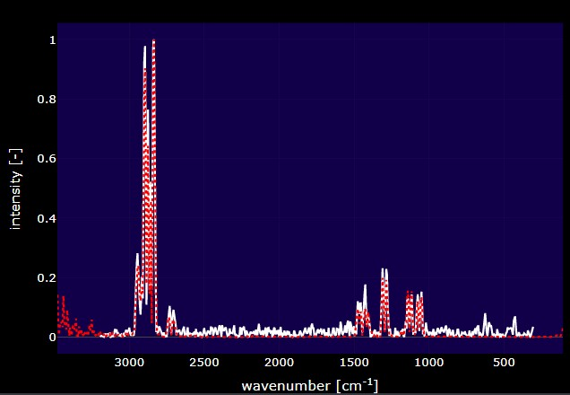
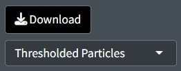

```{r, include = FALSE}
knitr::opts_chunk$set(
  collapse = TRUE,
  comment = "#>",
  warning = FALSE
)
```

# Document Overview 

This document outlines a common workflow for using the Open Specy 
app and highlights some topics that users are often requesting a tutorial on. If
the document is followed sequentially from beginning to end, the user will have
a better understanding of every procedure involved in using the Open Specy R
 app as a tool for interpreting spectra. It takes approximately 45
minutes to read through and follow along with this standard operating procedure
the first time. Afterward, knowledgeable users should be able to thoroughly
analyze spectra at an average speed of 1 min^-1^ or faster with the new batch
and automated procedures. If you are looking for documentation about the R package please see the [package vignette](http://wincowger.com/OpenSpecy-package/articles/sop.html)

# Running the App
To get started with the Open Specy user interface, access
[https://openanalysis.org/openspecy/](https://openanalysis.org/openspecy/)
or start the Shiny GUI directly from your own computer in R. 
If using the package, you just need to read in the library and run the command `run_app()`.

```{r setup}
library(OpenSpecy)
```

```{r eval = F}
run_app()
```

# Reading Data

Once the app is open, if you have your own data, click **Browse** at the top left hand corner of the
Analyze Spectra tab.

```{r, fig.align="center", out.width="98%", echo=FALSE}
knitr::include_graphics("app/mainpage.jpg")
```

Before uploading, indicate if you would like to share the uploaded data or not
using the slider. If selected, any data uploaded to the tool will automatically
be shared under [CC-BY 4.0
license](https://creativecommons.org/licenses/by/4.0/) and will be available for
researchers and other ventures to use to improve spectral analysis, build
machine learning tools, etc. Some users may choose not to share if they need to
keep their data private. If switched off, none of the uploaded data will be
stored or shared in Open Specy.

```{r, fig.align="center", echo=FALSE}
knitr::include_graphics("app/uploadfile.jpg")
```

Open Specy allows for upload of native Open Specy .y(a)ml, .json, or .rds files.
In addition, .csv, .asp, .jdx, .0, .spa, .spc, and .zip files can be imported.
.zip  files can either contain multiple files with individual spectra in them of
the non-zip formats or it can contain a .hdr and .dat file that form an ENVI
file for a spectral map. Open Specy and .csv files should always load correctly
but the other file types are still in development, though most of the time these
files work perfectly. If uploading a .csv file, label the column with the
wavenumbers `wavenumber` and name the column with the intensities `intensity`.
Wavenumber units must be cm^-1^. Any other columns are not used by the software.
Always keep a copy of the original file before alteration to preserve metadata
and raw data for your records.

```{r sample_data, echo=FALSE, out.width="50%"}
knitr::kable(head(raman_hdpe), caption = "Sample data `raman_hdpe`")
```

It is best practice to cross check files in the proprietary software they came
from and Open Specy before use in Open Specy. Due to the complexity of some
proprietary file types, we haven't been able to make them fully compatible yet.
If your file is not working, please contact the administrator and share the file
so that we can work on integrating it.

The specific steps to converting your instrument's native files to .csv can be
found in its software manual or you can check out
[Spectragryph](https://www.effemm2.de/spectragryph/), which supports many
spectral file conversions see [Spectragryph Tutorial](http://wincowger.com/OpenSpecy-package/articles/spectragryph.html).

If you don't have your own data, you can use a test dataset.

```{r, fig.align="center", echo=FALSE}
knitr::include_graphics("app/samplefile.jpg")
```

A .csv file of an HDPE Raman spectrum will download on your computer. This file
can also be used as a template for formatting .csv data into an Open Specy
accepted format.

# Visualization

## Spectra

In the app after spectral data are uploaded, it will appear in the main window.
This plot is selectable, zoomable, and provides information on hover. You can
also save a .png file of the plot view using the camera icon at the top right
when you hover over the plot. 

```{r, fig.align="center", echo=FALSE}
knitr::include_graphics("app/spectra_vis.jpg")
```


## Maps

Spectral maps can also be visualized as overlaid spectra but in addition the
spatial information can be plotted as a heatmap. A similar plot should appear in
the app if you upload multiple spectra or a spectral map. It is important to
note that when multiple spectra are uploaded in batch they are prescribed `x`
and `y` coordinates, this can be helpful for visualizing summary statistics and
navigating vast amounts of data but shouldn't be confused with data which
actually has spatial coordinates. Hovering over the map will reveal information
about the signal and noise and correlation values. Clicking the map will provide
the selected spectrum underneath. In the app, the colors of the heatmap are
either the signal and noise or the spectral identifications depending on whether
the identification is turned on or not. Pixels are black if the spectra does not
pass the signal-noise threshold and/or the correlation threshold.

```{r, fig.align="center", echo=FALSE}
knitr::include_graphics("app/map_vis.jpg")
```

# Processing

The goal of this processing is to increase the signal to noise ratio (S/N) without
distorting the shape or relative size of the peaks. After uploading data, you can preprocess the data using intensity adjustment,
baseline subtraction, smoothing, flattening, and range selection and save your
preprocessed data. Once the process button is selected the default processing
will initiate. This is an absolute derivative transformation, it is kind of
magic, it does something similar to smoothing, baseline subtraction, and
intensity correction simultaneously and really quickly. By clicking
preprocessing you should see the spectrum update with the processed spectra.

```{r, fig.align="center", echo=FALSE}
knitr::include_graphics("app/processing.jpg")
```
To view the raw data again, just deselect preprocessing. Toggling preprocessing
on and off can help you to make sure that the spectra are processed correctly.


## Threshold Signal-Noise

Considering whether you have enough signal to analyze spectra is important.
Classical spectroscopy would recommend your highest peak to be at least 10 times
the baseline of your processed spectra before you begin analysis. If your
spectra is below that threshold, you may want to consider recollecting it. In
practice, we are rarely able to collect spectra of that good quality and more
often use 5. The Signal Over Noise technique searches your spectra for high and
low regions and conducts division on them to derive the signal to noise ratio.
Signal Times Noise multiplies the mean signal by the standard deviation of the
signal and Total Signal sums the intensities. The latter can be really useful
for thresholding spectral maps to identify particles which we will discuss
later.

```{r, fig.align="center", echo=FALSE}
knitr::include_graphics("app/snr_threshold.jpg")
```

If analyzing spectra in batch, we recommend looking at the heatmap and
optimizing the percent of spectra that are above your signal to noise threshold
to determine the correct settings instead of looking through spectra
individually. Good Signal tells you what percent of your data are above your
signal threshold.

```{r, fig.align="center", echo=FALSE}
knitr::include_graphics("app/signal_settings.jpg")
```

## Intensity Adjustment

```{r, fig.align='center', echo=FALSE}
knitr::include_graphics("app/intensityadjustment.jpg")
```

Open Specy assumes that intensity units are in absorbance units but Open Specy
can adjust reflectance or transmittance spectra to absorbance units using this
selection. The transmittance adjustment uses the $\log_{10} 1/T$ calculation
which does not correct for system or particle characteristics. The reflectance
adjustment use the Kubelka-Munk equation $\frac{(1-R)^2}{2R}$. If none is
selected, Open Specy assumes that the uploaded data is an absorbance spectrum
and does not apply an adjustment.

## Conforming

Conforming spectra is essential before comparing to a reference library and can
be useful for summarizing data when you don't need it to be highly resolved
spectrally. In the app, conforming happens behind the scenes without any user
input to make sure that the spectra the user uploads and the library spectra
will be compatible. We set the spectral resolution to 5 because
this tends to be pretty good for a lot of applications and is in between 4 and 8
which are commonly used wavenumber resolutions. 

## Smoothing

```{r, fig.align="center", echo=FALSE}
knitr::include_graphics("app/smoothingpoly.jpg")
```

The value on the slider is
the polynomial order of the [Savitzky-Golay (SG)
filter](https://en.wikipedia.org/wiki/Savitzky%E2%80%93Golay_filter). Higher
numbers lead to more wiggly fits and thus less smooth, lower numbers lead to
more smooth fits. The SG filter is fit to a moving window of 11 data points by
default where the center point in the window is replaced with the polynomial
estimate. Larger windows will produce smoother fits. The derivative order is set
to 1 by default which transforms the spectra to their first derivative. A zero
order derivative will have no derivative transformation. When smoothing is done
well, peak shapes and relative heights should not change. The absolute value is
primarily useful for first derivative spectra where the absolute value results
in an absorbance-like spectrum which is why we set it as the default.

## Baseline Correction

```{r, fig.align="center", echo=FALSE}
knitr::include_graphics("app/baselinecorrectionpoly.jpg")
```

The goal of baseline correction is to get all non-peak regions of the spectra to
zero absorbance. The higher the polynomial order, the more wiggly the fit to the
baseline. If the baseline is not very wiggly, a more wiggly fit could remove
peaks which is not desired. The baseline correction algorithm used in Open Specy
is called "iModPolyfit" (Zhao et al. 2007). This algorithm iteratively fits
polynomial equations of the specified order to the whole spectrum. During the
first fit iteration, peak regions will often be above the baseline fit. The data
in the peak region is removed from the fit to make sure that the baseline is
less likely to fit to the peaks. The iterative fitting terminates once the
difference between the new and previous fit is small. An example of a good
baseline fit below. For those who have been with OpenSpecy a while, you will
notice the app no longer supports manual baseline correction, it was a hard
choice but it just didn't make sense to keep it now that we are moving toward
high throughput automated methods. It does still exist in the R function though.

## Range Selection

```{r, fig.align="center", echo=FALSE}
knitr::include_graphics("app/rangeselection.jpg")
```

Sometimes an instrument operates with high noise at the ends of the spectrum
and, a baseline fit produces distortions, or there are regions of interest for
analysis. Range selection accomplishes those goals. You should look into the
signal to noise ratio of your specific instrument by wavelength to determine
what wavelength ranges to use. Distortions due to baseline fit can be assessed
from looking at the preprocess spectra. Additionally, you can restrict the range
to examine a single peak or a subset of peaks of interests. The maximum and
minimum wavenumbers will specify the range to keep in the app.

## Flattening Ranges

```{r, fig.align="center", echo=FALSE}
knitr::include_graphics("app/flattten_example.jpg")
```

Sometimes there are peaks that really shouldn't be in your spectra and can
distort your interpretation of the spectra but you don't necessarily want to
remove the regions from the analysis because you believe those regions should be
flat instead of having a peak. One way to deal with this is to replace the peak
values with the mean of the values around the peak. This is the purpose of the
Flatten Range. By default it is set to flatten the CO2 region for
FTIR spectra because that region often needs to be flattened when atmouspheric
artefacts occur in spectra. 

## Min-Max Normalization

Min-Max normalization is used throughout the app but is not one of the options
the user can specify. Often we regard spectral intensities as arbitrary and
min-max normalization allows us to view spectra on the same scale without
drastically distorting their shapes or relative peak intensities. In the app, it
is primarily used for plotting and as a processing step before correlation
analysis. 

## Downloading Processed Data

You can download a csv file of your processed data using the Your Spectra option with download. This will download a version of your spectra with whatever processing options you have selected at the time. 

```{r, fig.align="center", echo=FALSE}
knitr::include_graphics("app/download_yourspec.jpg")
```

# Identifying Spectra 

```{r, fig.align="center", echo=FALSE}
knitr::include_graphics("app/identification.jpg")
```

After uploading data and preprocessing it (if desired) you can now identify the
spectrum. To identify the spectrum go to the **Identification** box. Pro tip: if
you select **Identification** without uploading data to the app, you'll be able
to explore the library by itself.

## Reading Libraries

These options define the strategy for identification. The **ID Library** will inform
which library is used. Both (default) will search both FTIR and Raman libraries.
Deriv will search against a derivative transformed library. No Baseline will
search against a baseline corrected library. This should be in line with how you
choose to process your spectra. Cor options use a simple Pearson correlation
search algorithm. AI is currently experimental and uses either a multinomial
model or correlation on mediod spectra from the library. Correlation
thresholding will set the minimum value from matching to use as a 'positive
identification' this will black out pixels in a spectral map view if they are lower than the threshold. 

## Matches

```{r, fig.align="center", echo=FALSE}
knitr::include_graphics("app/matches.jpg")
```

Top matches in the app can be assessed by clicking the cog in the right hand
corner of the Spectra box. This will open a side window with the matches sorted
from most to least similar. Clicking on rows in the table will add the selected
match to the spectra viewer. Using the table's filter options, you can restrict
the range of Pearson\'s r values or search for specific material types.

## Selection Metadata

```{r, fig.align="center", out.width="98%", echo=FALSE}
knitr::include_graphics("app/selectionmetadata.jpg")
```

Whatever match is selected from the match table may have additional metadata
about it. That metadata will be displayed below the plot. Some of this metadata
may assist you in interpreting the spectra. For example, if the spectra has
metadata which says it is a liquid and you are analyzing a solid particle, that
spectrum may not be the best match.

## Match Plot

```{r, fig.align="center", echo=FALSE}

```

This plot is dynamically updated by selecting matches from the match table. The
red spectrum is the spectrum that you selected from the reference library and
the white spectrum is the spectrum that you are trying to identify. Whenever a
new dataset is uploaded, the plot and data table in this tab will be updated.
These plots can be saved as a .png by clicking the camera button at the top of
the plot.

## Sharing Reference Data

If you have reference data or AI models that you think would be useful for
sharing with the spectroscopy community through OpenSpecy please contact the
website administrator to discuss options for collaborating.

## Download Top Matches

To download the top matches and associated metadata, use the top matches download option. 
```{r, fig.align="center", echo=FALSE}
knitr::include_graphics("app/download.jpg")
```

# Characterizing Particles

```{r, fig.align="center", echo=FALSE}

```

Thresholding only works and shouldn't be used for single particles. You can threshold spectral maps using the signal-noise values and/or the correlation threshold. Whatever selection you have active will inform how your spectra is thresholded. It should get thresholded in coincidence with what you see on the spectral map. Pro tip: The file that gets downloaded is an OpenSpecy with median spectra for each of your thresholded particles. You can upload that back to the app and analyze that independently. 

## Additional App Features

Accessibility is extremely important to us and we are making strives to improve
the accessibility of Open Specy for all spectroscopists. Please reach out if you
have ideas for improvement.

We added a Google translate plugin to all pages in the app so that you can
easily translate the app. We know that not all languages will be fully supported
but we will continue to try and improve the translations.

```{r, fig.align="center", echo=FALSE}

```

# References

Chabuka BK, Kalivas JH (2020). “Application of a Hybrid Fusion Classification
Process for Identification of Microplastics Based on Fourier Transform Infrared
Spectroscopy.” *Applied Spectroscopy*, **74**(9), 1167–1183. doi:
[10.1177/0003702820923993](https://doi.org/10.1177/0003702820923993).

Cowger W, Gray A, Christiansen SH, Christiansen SH, Christiansen SH, De Frond H,
Deshpande AD, Hemabessiere L, Lee E, Mill L, et al. (2020). “Critical Review of
Processing and Classification Techniques for Images and Spectra in Microplastic
Research.” *Applied Spectroscopy*, **74**(9), 989–1010. doi:
[10.1177/0003702820929064](https://doi.org/10.1177/0003702820929064).

Cowger W, Steinmetz Z, Gray A, Munno K, Lynch J, Hapich H, Primpke S,
De Frond H, Rochman C, Herodotou O (2021). “Microplastic Spectral Classification
Needs an Open Source Community: Open Specy to the Rescue!”
*Analytical Chemistry*, **93**(21), 7543–7548. doi:
[10.1021/acs.analchem.1c00123](https://doi.org/10.1021/acs.analchem.1c00123).

Primpke S, Wirth M, Lorenz C, Gerdts G (2018). “Reference Database Design for
the Automated Analysis of Microplastic Samples Based on Fourier Transform
Infrared (FTIR) Spectroscopy.” *Analytical and Bioanalytical Chemistry*,
**410**(21), 5131–5141. doi: 
[10.1007/s00216-018-1156-x](https://doi.org/10.1007/s00216-018-1156-x).

Renner G, Schmidt TC, Schram J (2017). “A New Chemometric Approach for Automatic
Identification of Microplastics from Environmental Compartments Based on FT-IR
Spectroscopy.” *Analytical Chemistry*, **89**(22), 12045–12053. doi: 
[10.1021/acs.analchem.7b02472](https://doi.org/10.1021/acs.analchem.7b02472).

Savitzky A, Golay MJ (1964). “Smoothing and Differentiation of Data by
Simplified Least Squares Procedures.” *Analytical Chemistry*, **36**(8),
1627–1639.

Zhao J, Lui H, McLean DI, Zeng H (2007). “Automated Autofluorescence Background
Subtraction Algorithm for Biomedical Raman Spectroscopy.”
*Applied Spectroscopy*, **61**(11), 1225–1232. doi:
[10.1366/000370207782597003](https://doi.org/10.1366/000370207782597003).
