```{r, include = FALSE}
knitr::opts_chunk$set(
  collapse = TRUE,
  comment = "#>"
)
```

Open Specy Raman and (FT)IR spectral analysis tool for plastic particles and
other environmental samples. Supported features include reading spectral data
files (.asp, .csv, .jdx, .spc, .spa, .0), smoothing spectral intensities
with `smooth_intensity()`, correcting background with 
`subtract_background()`, and identifying spectra using an onboard reference
library. Analyzed spectra can be shared with the Open Specy community.
A Shiny app is available via `run_app()` or online at
[http://www.openspecy.org](http://www.openspecy.org).

This document outlines a common workflow for
using Open Specy and highlights some topics that users are often
requesting a tutorial on. If the document is followed sequentially from
beginning to end, the user will have a better understanding of every
procedure involved in using Open Specy as a tool for interpreting
spectra. It takes approximately 45 minutes to read through and follow
along with this standard operating procedure the first time. Afterward,
knowledgeable users should be able to thoroughly analyze individual
spectra at an average speed of 1 min^-1^.

# Getting started

```{r setup}
library(OpenSpecy)
```

# Viewing and Sharing Spectra

To get started with the Open Specy user interface, access
[www.openspecy.org](http://www.openspecy.org)
or start the Shiny GUI directly from R typing

```{r eval=FALSE}
run_app()
```

Then click the **Upload File** tab at the top of the page.

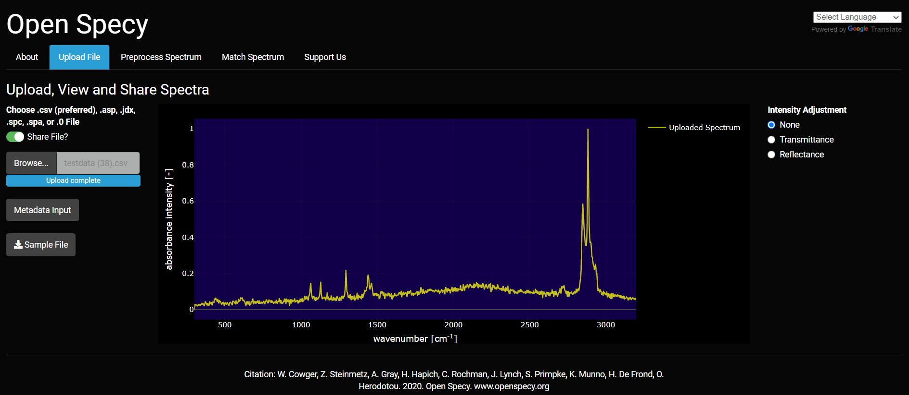
Accessibility is extremely important to us and we are making strives to improve the accessibility of Open Specy for all spectroscopists. Please reach out if you have ideas for improvement.

We added a Google translate plugin to all pages in the app so that you can easily translate the app. We know that not all languages will be fully supported but we will continue to try and improve the translations.  


## Download a test dataset


If you don't have your own data to use right away, that is ok. You can
download test data to try out the tool by clicking on the test data
button. A .csv file of HDPE Raman spectrum will download on your
computer. This file can also be used as a template for formatting .csv
data into an Open Specy accepted format. The following line of code does the
same:

```{r eval=FALSE}
data("raman_hdpe")
```

## Choose whether to share your uploaded data or not


Before uploading, indicate if you would like to share the
uploaded data or not using the slider. If selected,
any data uploaded to the tool will automatically be shared under [CC-BY 4.0 license](https://creativecommons.org/licenses/by/4.0/)
and will be available for
researchers and other ventures to use to improve spectral analysis,
build machine learning tools, etc. Some users may choose not to share if
they need to keep their data private. If switched off, none of
the uploaded data will be stored or shared in Open Specy.

## Upload/Read Data

Open Specy allows for upload of .csv, .asp, .jdx, .0, .spc, and
.spa files. .csv files should always load correctly but the other file
types are still in beta development, though most of the time these files
work perfectly. It is best practice to cross check files in the
proprietary software they came from and Open Specy before use in Open
Specy. Due to the complexity of these file types, we haven't been able
to make them fully compatible yet. If your file is not working, please
contact the administrator and share the file so that we can get it to
work.

For the most consistent results, files should be converted to .csv
format before uploading to Open Specy. The specific steps to converting
your instrument's native files to .csv can be found in its software
manual or you can check out
[Spectragryph](https://www.effemm2.de/spectragryph/), which supports many
spectral file conversions (see Mini Tutorial section: File conversion in
Spectragryph to Open Specy accepted format).

If uploading a .csv file, label the column with the wavenumbers
`wavenumber` and name the column with the intensities `intensity`.

```{r sample_data, echo=FALSE, out.width="50%"}
knitr::kable(head(raman_hdpe), caption = "Sample data `raman_hdpe`")
```

Wavenumber units must be cm^-1^. Any other columns are not used by the
software. Always keep a copy of the original file before alteration to preserve
metadata and raw data for your records.

To upload data, click **Browse** and choose one of your
files to upload, or drag and drop your file into the gray box. At this
time you can only upload one file at a time. 

Upon upload and throughout the analysis, intensity values are min-max normalized:

$$\frac{x - \mathrm{min}(x)}{\mathrm{min}(x) - \mathrm{max}(x)}$$
The following R functions from the Open Specy package will also read in spectral data accordingly:

```{r, eval=FALSE}
read_text(".csv")
read_asp(".asp")
read_0(".0")
```

## Viewing Spectra Plot

After spectral data are uploaded, it will appear in the main window. This plot
is selectable, zoomable, and provides information on hover. You can also
save a .png file of the plot view using the camera icon at the top right when
you hover over the plot. This plot will change the view based on updates
from the **Intensity Adjustment** selection.

## Intensity Adjustment


Open Specy assumes that intensity units are in absorbance units but
Open Specy can adjust reflectance or transmittance spectra to absorbance
units using this drop down in the upload file tab. The transmittance
adjustment uses the $\log_{10} 1/T$ calculation which does not correct for
system or particle characteristics. The reflectance adjustment
use the Kubelka-Munk equation $\frac{(1-R)^2}{2R}$. If none is selected, Open
Specy assumes that the uploaded data is an absorbance spectrum and does not
apply an adjustment.

This is the respective R code:

```{r}
library(dplyr)

raman_adj <- raman_hdpe %>%
  adjust_intensity()

head(raman_adj)
```

## Share metadata on known spectra

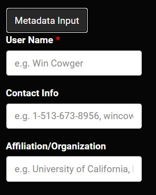

When sharing data, please provide as much metadata as you can. Metadata
helps make shared data as useful as possible. Metadata inputs each have
examples provided in the input. The examples disappear when the box is
clicked and will not be saved if nothing is input by the user.
Mandatory inputs are marked with a red asterisk. If these inputs are not
filled, the data will be considered uninterpretable and will be
discarded. Inputs left blank will be left blank in the metadata sheet
and interpreted as "unknown" or "not applicable". To share metadata,
click the share data button at the bottom of the metadata inputs.

When the user clicks the **Share Data** button their current uploaded data
and metadata is sent to an
[open-access online repository](https://osf.io/rjg3c/).


All inputs from the metadata (described below) are input to a
metadata sheet. The metadata sheet is
given the same unique name as the data, but it ends with "\_form". The
exact same data is saved as would be downloaded using the download data
button (described below). All high quality uploaded data with metadata
will eventually be reviewed by spectroscopy experts and added to the
internal library if it passes review. If multiple files are going to be
uploaded with metadata, the cells will also stay filled with the last
input after the share data button is clicked. Just upload the next
dataset and change the metadata inputs that are different. If more than
50 files will be shared at once, you can contact the website
administrator to get a bulk upload sheet for more rapid upload.

Type

```{r eval=FALSE}
share_spectrum(raman_hdpe,
               metadata = c(user_name = "Win Cowger",
                            contact_info = "wincowger@gmail.com",
                            spectrum_type = "Raman",
                            spectrum_identity = "HDPE")
               )
```

to share your spectral data from the R console.

# Preprocessing

After uploading data, you can preprocess the data using baseline
correction, smoothing, and range selection and save your preprocessed
data. Go to the **Preprocess Spectrum** tab to select
your parameters for processing the spectrum.

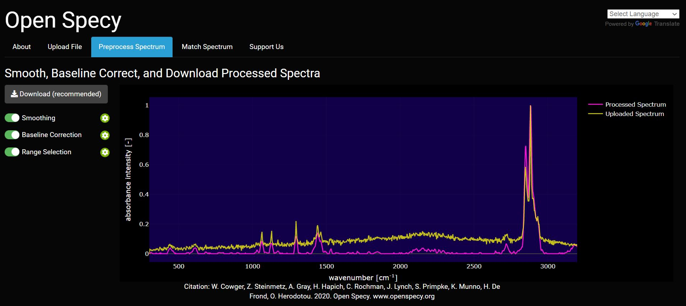

## Preprocess Spectra Plot

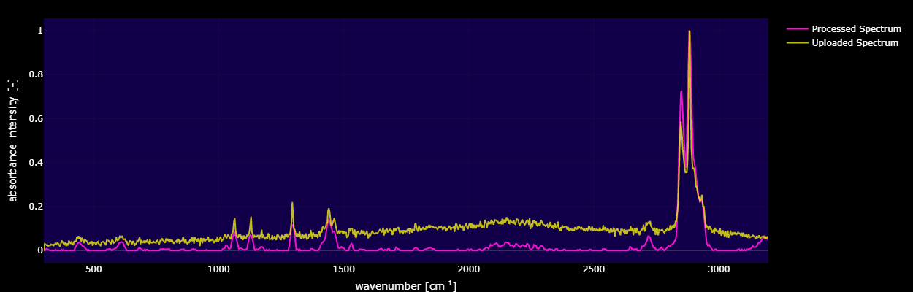

The preprocess spectra plot shows the uploaded spectra in comparison to
the processed spectra that has been processed using the processing
inputs on the page. It will automatically update with any new slider
inputs. This allows the user to tune the inputs to optimize the signal
to noise ratio. The goal with preprocessing is to make peak regions have
high intensities and non-peak regions should have low intensities.

## Preprocessing Tools


When the slider is green for the tool type, that means that that tool is being used to preprocess the spectrum. If the slider is clicked blank, the cog button to the right will disappear to indicate that the tool is no longer being used. 


If the cog button is clicked, any functions associated with that tool will be displayed and can be manipulated to process the spectrum. 

## Smoothing Polynomial


The first step of the Open Specy preprocessing routing is spectral
smoothing. The goal of this function is to increase the signal to noise
ratio (S/N) without distorting the shape or relative size of the peaks.
The value on the slider is the polynomial order of the
[Savitzky-Golay (SG) filter](https://en.wikipedia.org/wiki/Savitzky%E2%80%93Golay_filter). 
The SG filter is fit to a moving window of 11 data points where the center
point in the window is replaced with the polynomial estimate. The
number of data points in the window is not user adjustable. Higher
numbers lead to more wiggly fits and thus less smooth, lower numbers
lead to more smooth fits, a 7th order polynomial will make the spectrum
have almost no smoothing. If smoothing is set to 0 then no smoothing is
conducted on the spectrum. When smoothing is done well, peak shapes and
relative heights should not change. Typically a 3rd order
polynomial (3 on the slider) works to increase the signal to
noise without distortion, but if the spectrum is noisy, decrease
polynomial order and if it is already smooth, increase the polynomial
order to the maximum (7). Examples of smoothing below.

```{r smoothing, fig.cap = "Sample `raman_hdpe` spectrum with different smoothing polynomials (p) from Cowger et al. (2020).", echo=FALSE}
library(ggplot2)
data("raman_hdpe")

compare_smoothing <- rbind(
  cbind(smoothing = "none", adjust_intensity(raman_hdpe)),
  cbind(smoothing = "p = 1", smooth_intensity(raman_hdpe, p = 1)),
  cbind(smoothing = "p = 4", smooth_intensity(raman_hdpe, p = 4))
)

ggplot(compare_smoothing, aes(wavenumber, intensity)) +
  geom_line(aes(color = smoothing)) +
  theme_minimal()
```

## Baseline Correction Polynomial


The second step of Open Specy's preprocessing routine is baseline
correction. The goal of baseline correction is to get all non-peak
regions of the spectra to zero absorbance. The higher the polynomial order,
the more wiggly the fit to the baseline. If the baseline
is not very wiggly, a more wiggly fit could remove peaks which is not
desired. The baseline correction algorithm used in Open Specy is called
"iModPolyfit" (Zhao et al. 2007). This algorithm iteratively fits polynomial
equations of the
specified order to the whole spectrum. During the first fit iteration,
peak regions will often be above the baseline fit. The data in the peak
region is removed from the fit to make sure that the baseline is less
likely to fit to the peaks. The iterative fitting terminates once the
difference between the new and previous fit is small. An example of a
good baseline fit below.

```{r subtraction, fig.cap = "Sample `raman_hdpe` spectrum with different degrees of background subtraction (Cowger et al., 2020).", echo=FALSE}
library(ggplot2)
data("raman_hdpe")

compare_subtraction <- rbind(
  cbind(fitting = "none", adjust_intensity(raman_hdpe)),
  cbind(fitting = "degree = 2", subtract_background(raman_hdpe, degree = 2)),
  cbind(fitting = "degree = 8", subtract_background(raman_hdpe, degree = 8))
)

ggplot(compare_subtraction, aes(wavenumber, intensity)) +
  geom_line(aes(color = fitting)) +
  theme_minimal()
```

## Spectral Range


The final step of preprocessing is restricting the spectral range.
Sometimes the instrument operates with high noise at the ends of the
spectrum and sometimes the baseline fit can produce distortions at the
ends of the spectrum, both can be removed using this routine. You should
look into the signal to noise ratio of your specific
instrument by wavelength to determine what wavelength ranges to use.
Distortions due to baseline fit can be assessed from looking at the
preprocess spectra plot. Additionally, you can restrict the range
to examine a single peak or a subset of peaks of interests. This
function allows users to isolate peaks of interest for matching, while
removing noise and influence from less relevant spectral data.

## Download Data


After you have the preprocessing parameters set, we recommend that you
download the preprocessed data for your records. The download data
button will append the uploaded data to three columns created by the
preprocessing parameters. "Wavelength" and "Absorbance" are columns from
the data uploaded by the user. "NormalizedIntensity" is the max-min
normalized value (Eqn. 1) of the "Absorbance". "Smoothed" is the
Savitzky-Golay filter specified by the slider explained above.
"BaselineRemoved" is the smoothed and baseline corrected value that is
visible on the center plot.

# Matching


After uploading data and preprocessing it (if desired) you can now
identify the spectrum. To identify the spectrum go to the **Match
Spectrum** tab.

You will see your spectrum and the top matches, but before looking at
matches, you need to check the three selectable
parameters below.

## Spectrum Type

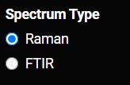

The spectra type input on the "Match spectra" tab specifies the type of
spectra (Raman or FTIR) that the user has uploaded and wants to match
to. This input will tell the website whether to use the FTIR library or
the Raman library to make the match.

## Spectrum To Analyze

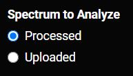

The spectra to analyze input specifies if the tool will match the
**Uploaded** spectra (unaltered by the inputs on the **Preprocess Spectra**
tab) or the **Processed" spectra** (manipulated by the inputs in the
Preprocess Spectra Tab).

## Region To Match


The region to match input specifies if the "Full Spectrum" will match
the entire range of the spectra (including non peak regions) in the
reference database. This is the most intuitive match. Or should the
**Peaks Only** match just the peak regions in the reference database. This
is an advanced feature proposed in Renner et al. (2017).
This can be a less intuitive approach but in cases where
there are few peaks and high baseline interference, it could be the best
option. In cases where non-peak regions are important for the
interpretation of the match, this is not the best approach.

## Match Table


The same table can be returned using the Open Specy library commands in the R Console. 

```{r subtraction, fig.cap = "Sample `raman_hdpe` spectrum with different degrees of background subtraction (Cowger et al., 2020).", echo=FALSE}
library(ggplot2)
data("raman_hdpe")
get_lib()

# Load library into global environment
spec_lib <- load_lib()

raman_proc <- raman_hdpe %>%
  adjust_intensity() %>% 
  smooth_intensity() %>% 
  subtract_background()

# Match spectrum with library and retrieve meta data
match_spectrum(raman_proc, library = spec_lib, which = "raman")

find_spectrum(sample_name == 5381, library = spec_lib, which = "raman")

```

The selectable table shows the top material matches returned by the
tool, their Pearson's r value, and the organization they were provided
by. When rows are selected their spectra are added to the match plot.
The spectrum being matched and reference library are determined by the
previously mentioned parameters. During the matching process, one final
cleaning step happens using a simple minimum subtraction algorithm
(Equation 2) which in many cases will allow unprocessed spectra to
remove subtle baseline, but will not harm the spectra which has no
baseline. Then, these aligned data are tested for correlation using the
Pearson's r. The Pearson's r is used as a match quality indicator and
the spectra from the top 1000 best matches are returned from the
library. You can restrict the libraries which are displayed in the table
by clicking the box that says "All" under the Organization column.
Similarly you can restrict the range of Pearson\'s r values or search
for specific material types.

$$\mathrm{for~each}~peak~group^{1,n}: x - \mathrm{min}(x)$$
<p style="text-align: center;">Equation 2: Minimum Subtraction</p>

## Selection Metadata


Whatever match is selected from the match table may have additional
metadata about it. That metadata will be displayed below the plot. Some
of this metadata may assist you in interpreting the spectra. For
example, if the spectra has metadata which says it is a liquid and you
are analyzing a solid particle, that spectrum may not be the best match.

## Match Plot

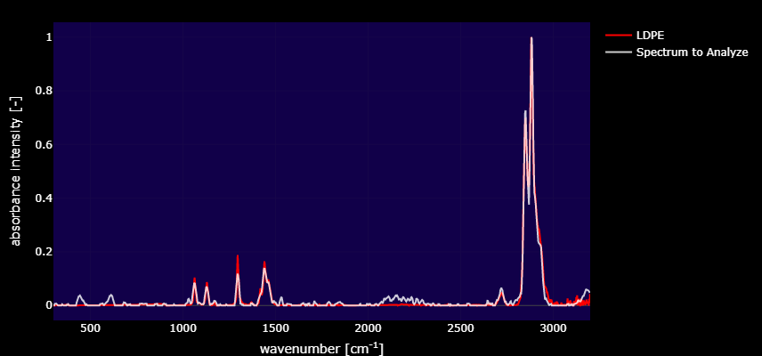

This plot is dynamically updated by selecting matches from the match
table. The red spectrum is the spectrum that you selected from the
reference library and the white spectrum is the spectrum that you are
trying to identify. Whenever a new dataset is uploaded, the plot and
data table in this tab will be updated. These plots can be saved as a
.png by clicking the camera button at the top of the plot.

## How to interpret the reported matches

There are several important things to consider when interpreting a
spectral match including the library source, the Pearson's r, and other
metrics.

### The library source

When you click on a spectrum, all of the metadata that we have in Open
Specy about that source will be displayed in a metadata window below to
the matches table. Each library has different methodologies used to
develop it. It is useful to read up on the library sources from the
literature that they came from. E.g. Chabuka et
al. 2020 focuses on weathered plastics, so matching to it
may suggest that your spectrum is of a weathered polymer. Primpke
et al. 2018 only has a spectral range up to 2000, so some polymers may
be difficult to differentiate with it. Make sure to cite the libraries
that you use during your search when you publish your results.
The authors were kind enough to make their data open access so that it
could be used in Open Specy and we should return the favor by citing
them.

### Pearson's r

Correlation values are used to identify the closest matches available
in the current Open Specy spectral libraries to improve material
identification and reduce sample processing times. Pearson's r values
range from 0 - 1 with 0 being a completely different spectrum and 1
being an exact match. Some general guidelines that we have observed from
using Open Specy. If no matches are \> \~0.3 the material
may require additional processing or may not exist in the Open Specy
library. Correlation values are not the only metric you should
use to assess your spectra's match to a material in the library, matches
need to make sense.

### Things to consider beyond correlation

Peak position and height similarities are more important than
correlation and need to be assessed manually. Peak position
correlates with specific bond types. Peak height correlates to
the concentration of a compound. Therefore, peak height and peak
position should match as closely as possible to the matched spectrum.
When there are peaks that exist in the spectra you are trying to
interpret that do not exist in the match, there may be additional
materials to identify. In this case, restrict the preprocessing range to
just the unidentified peak and try to identify it as an additional
component (see also
[https://www.compoundchem.com/2015/02/05/irspectroscopy/](https://www.compoundchem.com/2015/02/05/irspectroscopy/)).

Also, check the match metadata to see if the match makes sense.
Example: A single fiber cannot be a "cotton blend"
since there would be no other fibers to make up the rest of the blend.
Example: Cellophane does not degrade into fibers, so
a match for a fiber to cellophane wouldn't make
sense. Example: You are analyzing a particle
at room temperature, but the matched material is liquid at room
temperature. The material may be a component of the particle but it
cannot be the whole particle.

### How specific do you need to be in the material type of the match?

You can choose to be specific about how you classify a substance (e.g.
polyester, cellophane) or more general (e.g. synthetic, semi-synthetic,
natural, etc.). The choice depends on your research question. Using more
general groups can speed up analysis time but will decrease the
information you have for interpretation. To identify materials more
generally, you can often clump the identities provided by Open Specy to
suit your needs. For example, matches to "polyester" and "polypropylene"
could be clumped to the category "plastic".

### How to differentiate between similar spectra?

One common challenge is differentiating between LDPE and HDPE. But,
even with a low resolution instrument (MacroRAM, 2 cm^-1^ pixel^-1^),
you can still see some differences. From a wide view,
these low, medium, and high density PE samples all look relatively
similar (figures courtesy of Bridget O\'Donnell, Horiba Scientific):

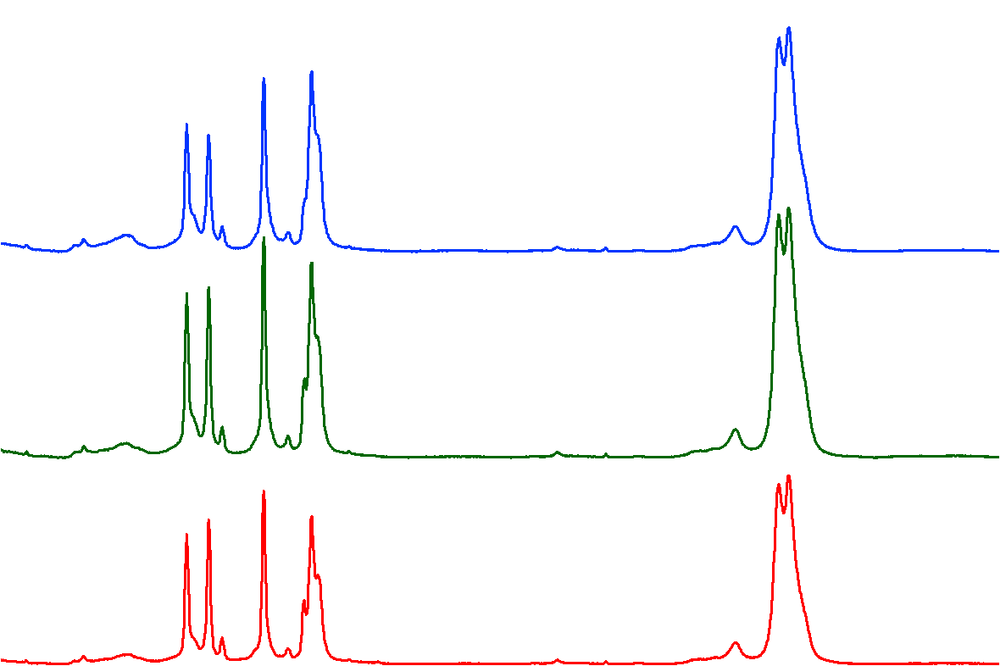

But, a closer look at the 1450 cm^-1^ band reveals
clear differences:

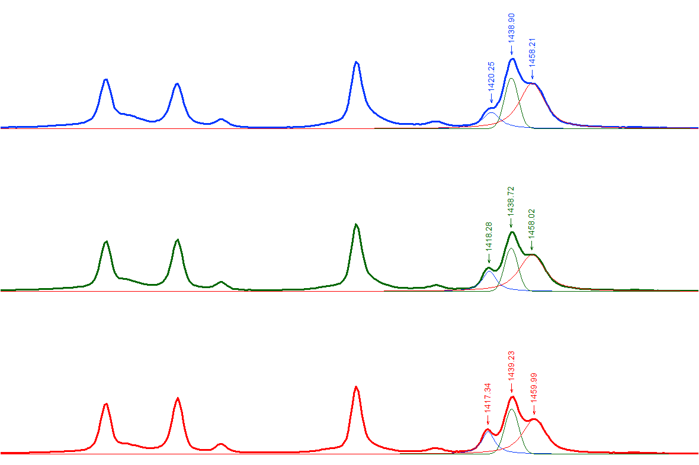

When you overlay them, you start to see differences in other spectral
regions too:

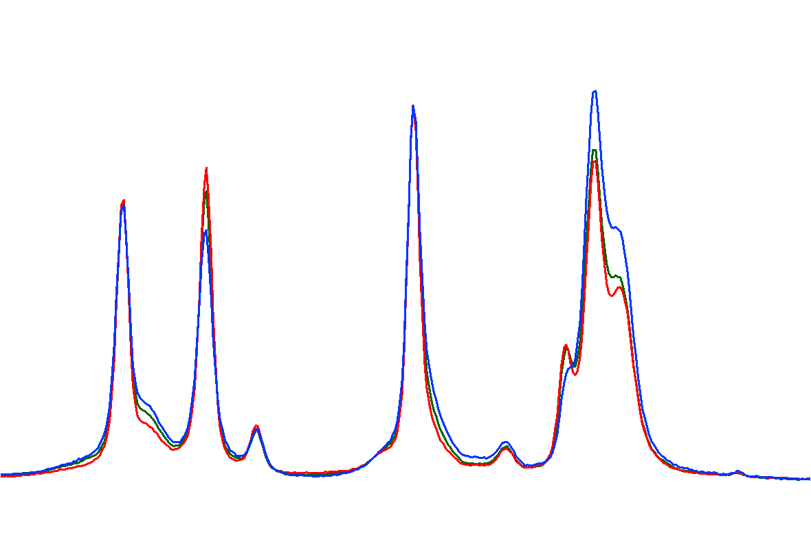

So, the question is, how do we deal with samples that are very similar
with only subtle differences? Usually, researchers will use MVA
techniques after they've collected multiple reference spectra of known
samples (LDPE and HDPE in this case). They can then develop models and
apply them to distinguish between different types of PE. With a
reference database like Open Specy, this is complicated by the fact that
researchers are measuring samples on different instruments with
correspondingly different spectral responses and spectral resolutions.
That makes it even more difficult to accurately match definitively to
LDPE and HDPE as opposed to generic 'PE'.

One possibility is to place more emphasis (from a computational
perspective) on the bands that show the most difference (the triplet at
1450 cm^-1^) by restricting the range used to match in
Open Specy. 

The other, much simpler option is to just match any PE hit to generic
'PE' and not specifically HDPE or LDPE.

Another challenge is in differentiating between types of nylons. But,
Raman has a pretty easy time distinguishing nylons. These spectra were
recorded of a series of nylons and the differences are much more
distinguishable compared to the PE results above (nylon 6, 6-6, 6-9,
6-10, and 6-12 top to
bottom):

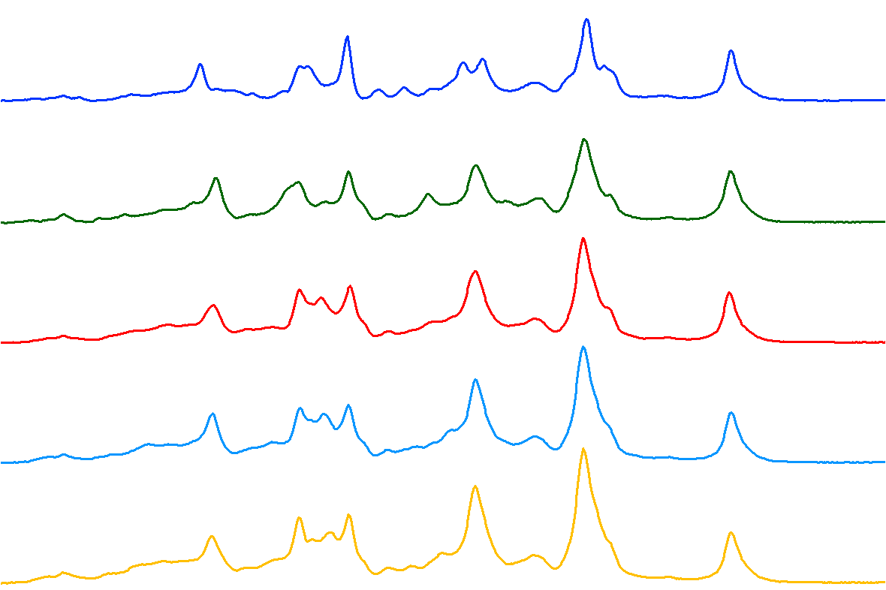

The differences are even more pronounced when you overlay the
spectra:

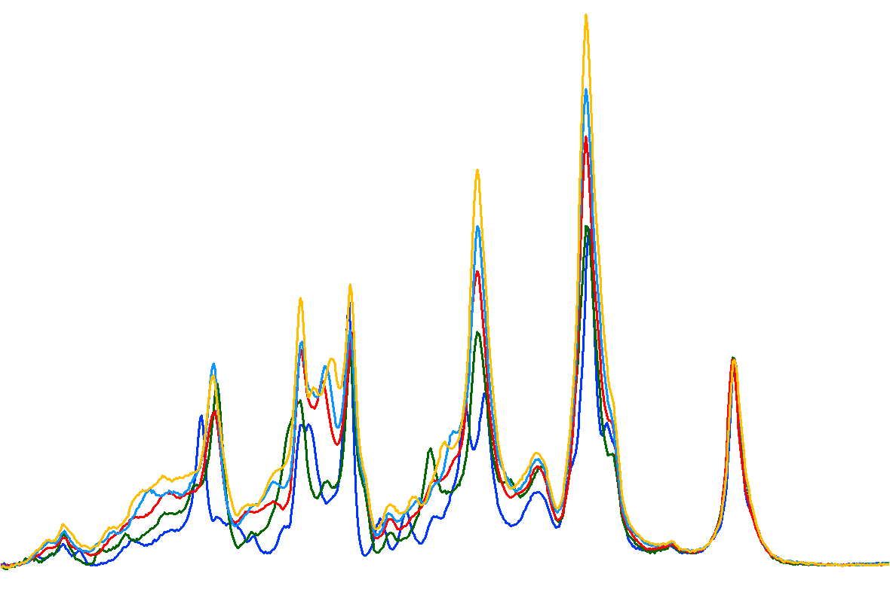

### What to do when matches aren't making sense

1.  Double check that the baseline correction and smoothing parameters
    result in the best preprocessing of the data. 
2.  Try reprocessing your spectrum, but limit it to specific peak
    regions with a higher signal to noise ratio.
3.  Restrict the spectral range to include or exclude questionable
    peaks or peaks that were not present in the previous matches.
4.  Restrict the spectral range to exclude things like CO~2~ (2200 cm^-1^)
    or H~2~O (\~1600 cm^-1^) in spikes in the IR spectrum.
5.  If nothing above works to determine a quality match, you may need
    to measure the spectrum of your material again or use another
    spectral analysis tool.

# Mini Tutorials

## File Conversion in SpectraGryph to Open Specy Accepted Format

1. Download Spectragryph from
[https://www.effemm2.de/spectragryph/down.html](https://www.effemm2.de/spectragryph/down.html)

2. Open Spectragryph and upload your file by dragging and dropping it
into the console.

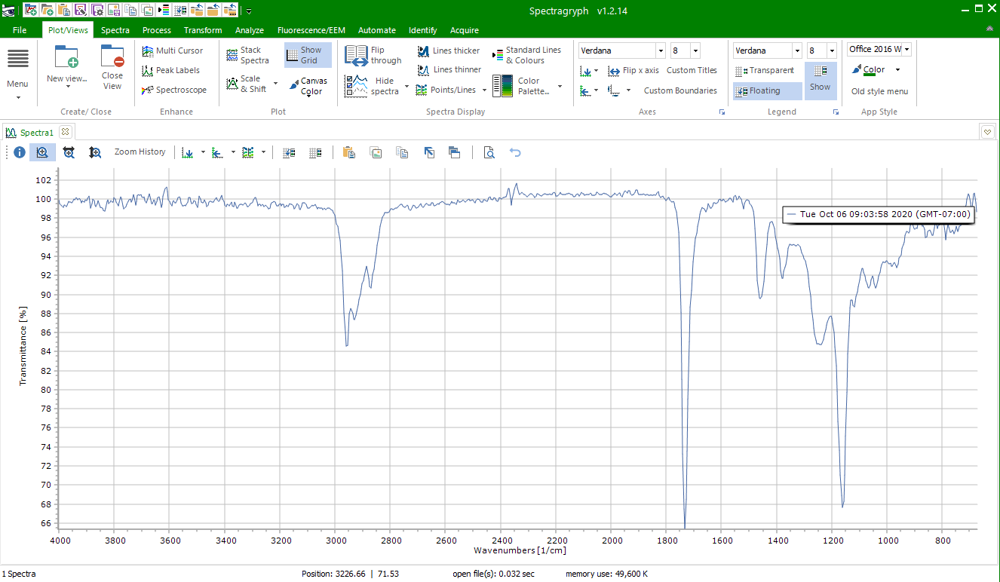

3. Click File, Save/export data, save data as, and save it as an spc
file. ¸

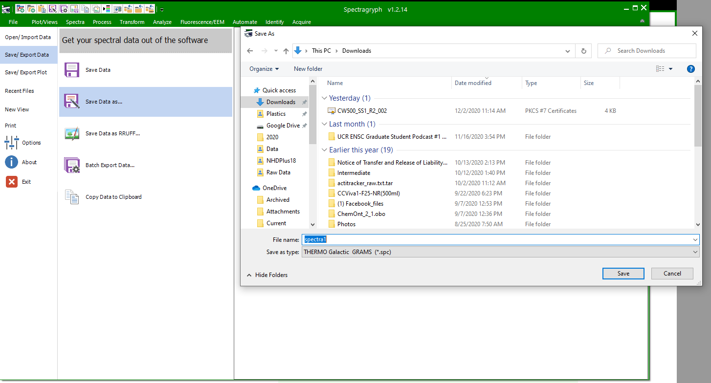

4. Then upload that -spc file to Open Specy.

<!-- []{style="width: 624.00px"} -->

## Conceptual diagram of data flow through Open Specy

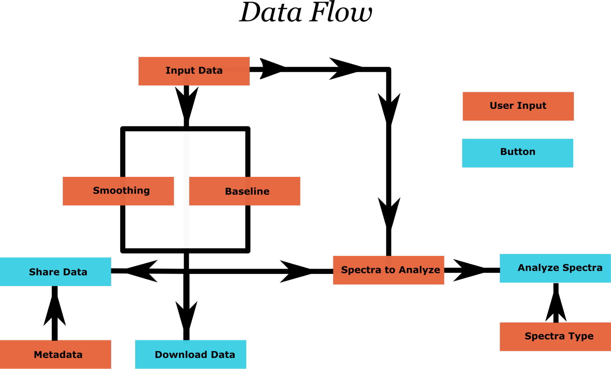{width=80%}


# References

Chabuka BK, Kalivas JH (2020). “Application of a Hybrid Fusion Classification
Process for Identification of Microplastics Based on Fourier Transform Infrared
Spectroscopy.” *Applied Spectroscopy*, **74**(9), 1167–1183.

Cowger W, Gray A, Christiansen SH, Christiansen SH, Christiansen SH, De Frond H,
Deshpande AD, Hemabessiere L, Lee E, Mill L, et al. (2020). “Critical Review of
Processing and Classification Techniques for Images and Spectra in Microplastic
Research.” *Applied Spectroscopy*, **74**(9), 989–1010.

Primpke S, Wirth M, Lorenz C, Gerdts G (2018). “Reference Database Design for
the Automated Analysis of Microplastic Samples Based on Fourier Transform
Infrared (FTIR) Spectroscopy.” *Analytical and Bioanalytical Chemistry*,
**410**(21), 5131–5141. doi: 
[https://doi.org/10.1007/s00216-018-1156-x](10.1007/s00216-018-1156-x).

Renner G, Schmidt TC, Schram J (2017). “A New Chemometric Approach for Automatic
Identification of Microplastics from Environmental Compartments Based on FT-IR
Spectroscopy.” *Analytical Chemistry*, **89**(22), 12045–12053. doi: 
[https://doi.org/10.1021/acs.analchem.7b024720](10.1021/acs.analchem.7b024720).

Savitzky A, Golay MJ (1964). “Smoothing and Differentiation of Data by
Simplified Least Squares Procedures.” *Analytical Chemistry*, **36**(8),
1627–1639.

Zhao J, Lui H, McLean DI, Zeng H (2007). “Automated Autofluorescence Background
Subtraction Algorithm for Biomedical Raman Spectroscopy.”
*Applied Spectroscopy*, **61**(11), 1225–1232.
