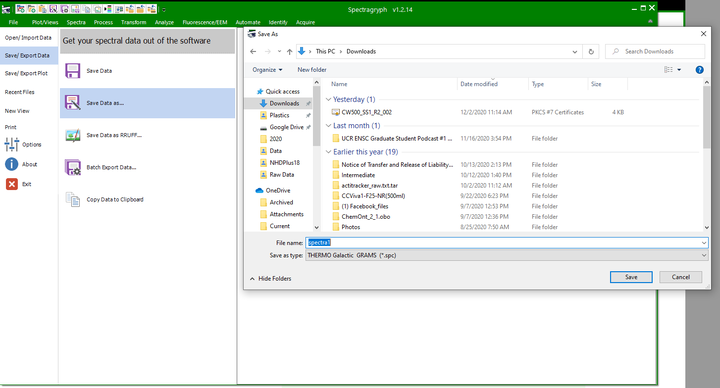

```{r, include = FALSE}
knitr::opts_chunk$set(
  collapse = TRUE,
  comment = "#>",
  warning = FALSE
)
```

1. Download Spectragryph from
[https://www.effemm2.de/spectragryph/down.html](https://www.effemm2.de/spectragryph/down.html)

2. Open Spectragryph and upload your file by dragging and dropping it into the
console.

```{r, fig.align="center", out.width="98%", echo=FALSE}
knitr::include_graphics("spectragryph/spectragryph-1.png")
```

3. Click File, Save/export data, save data as, and save it as an spc
file. ¸

```{r, fig.align="center", out.width="98%", echo=FALSE}

```

4. Then upload that .spc file to Open Specy.

```{r, fig.align="center", echo=FALSE}

```
