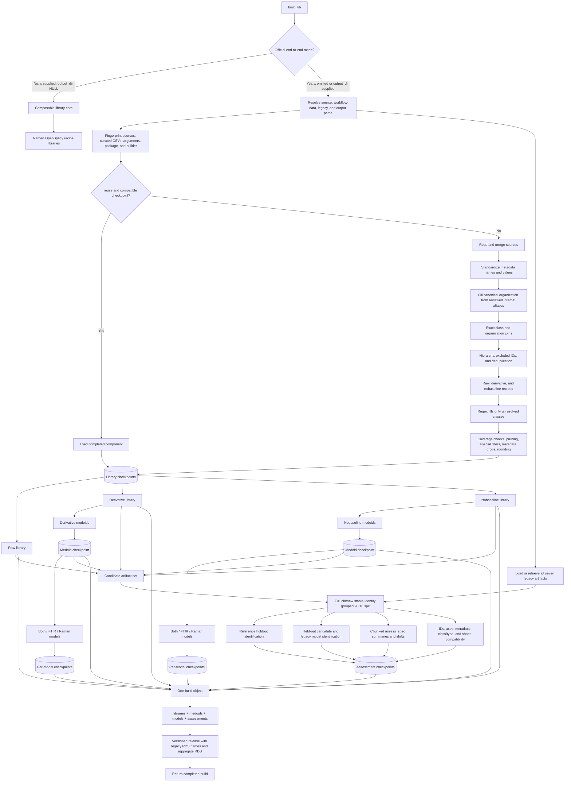

# `build_lib()` workflow

```mermaid
flowchart TD
    A[build_lib] --> B{Official end-to-end mode?}
    B -- "No: x supplied, output_dir NULL" --> C[Composable library core]
    C --> C1[Named OpenSpecy recipe libraries]

    B -- "Yes: x omitted or output_dir supplied" --> D[Resolve source, workflow-data, legacy, and output paths]
    D --> E[Fingerprint sources, curated CSVs, arguments, package, and builder]
    E --> F{reuse and compatible checkpoint?}
    F -- Yes --> G[Load completed component]
    F -- No --> H[Read and merge sources]
    H --> I[Standardize metadata names and values]
    I --> J[Fill canonical organization from reviewed internal aliases]
    J --> K[Exact class and organization joins]
    K --> L[Hierarchy, excluded IDs, and deduplication]
    L --> M[Raw, derivative, and nobaseline recipes]
    M --> N[Regex fills only unresolved classes]
    N --> O[Coverage checks, pruning, special filters, metadata drops, rounding]
    O --> P[(Library checkpoints)]
    G --> P

    P --> Q1[Raw library]
    P --> Q2[Derivative library]
    P --> Q3[Nobaseline library]
    Q2 --> R1[Derivative medoids]
    Q3 --> R2[Nobaseline medoids]
    R1 --> S1[(Medoid checkpoint)]
    R2 --> S2[(Medoid checkpoint)]
    S1 --> T1[Both / FTIR / Raman models]
    S2 --> T2[Both / FTIR / Raman models]
    T1 --> U1[(Per-model checkpoints)]
    T2 --> U2[(Per-model checkpoints)]

    D --> V[Load or retrieve all seven legacy artifacts]
    Q1 & Q2 & Q3 & S1 & S2 --> W[Candidate artifact set]
    V --> X[Full old/new stable-identity grouped 90/10 split]
    W --> X
    X --> Y1[Reference holdout identification]
    X --> Y2[Held-out candidate and legacy model identification]
    X --> Y3[Chunked assess_spec summaries and shifts]
    X --> Y4[IDs, axes, metadata, class/type, and shape compatibility]
    Y1 & Y2 & Y3 & Y4 --> Z[(Assessment checkpoints)]

    Q1 & Q2 & Q3 & S1 & S2 & U1 & U2 & Z --> AA[One build object]
    AA --> AB[libraries + medoids + models + assessments]
    AB --> AC[Versioned release with legacy RDS names and aggregate RDS]
    AC --> AD[Return completed build]
```
